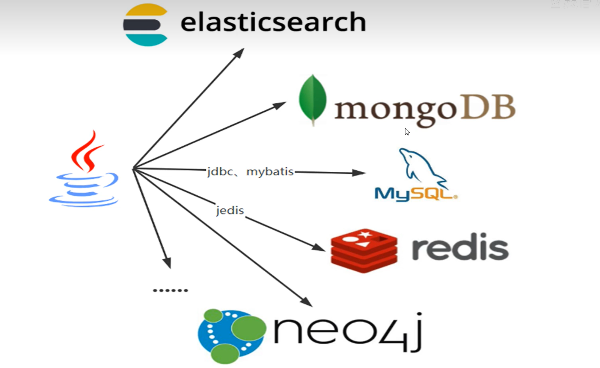
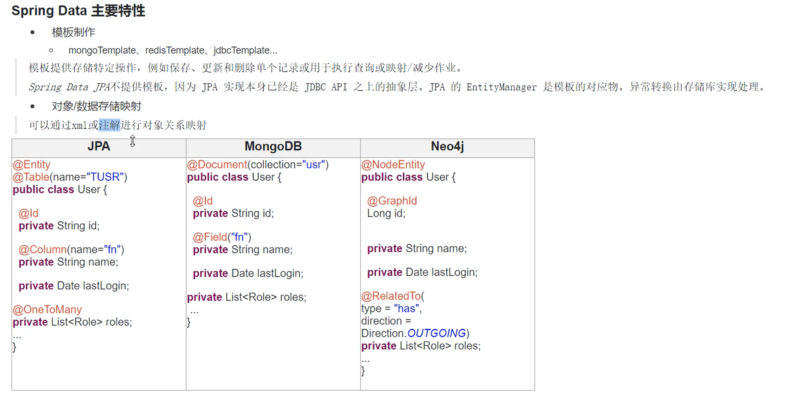
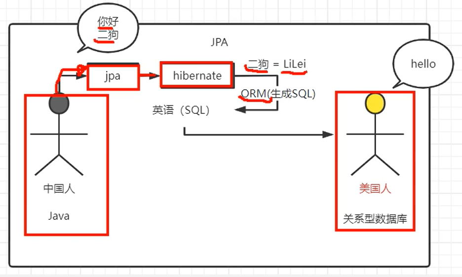
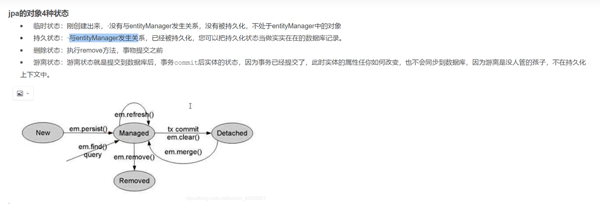
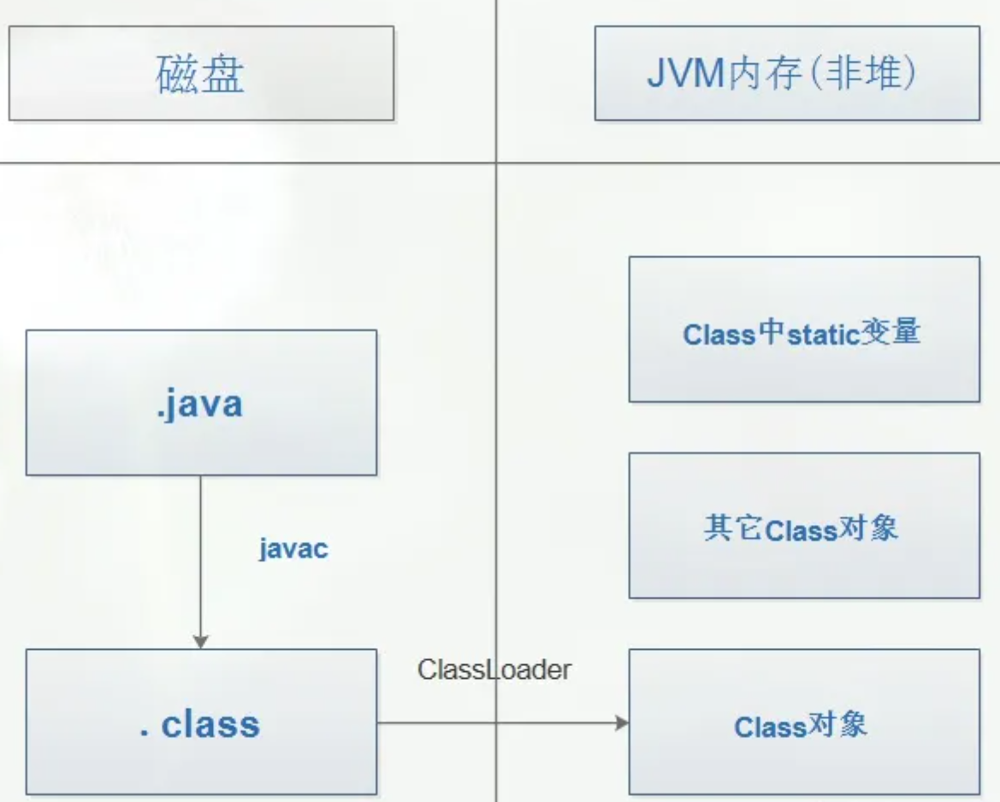

写了一些简介，没那么多时间写了 看这位大佬的springdata jpa吧
https://blog.csdn.net/qq_42495847/article/details/107991361
## 一、SpringData

- SpringData致力于为数据访问层，(DAO)提供统一的基于Spring的编程模版
对于每一种持久性存储，都需要为其搞一套CRUD（创建-读取-更新-删除），SpringData提供了一个通用的接口和模版

总结：简化开发-统一

## 二、SpringData JPA
### 1.简介
- JPA全称 Java Persistence API(2019年重命名成 Jakarta ...) ,是一种ORM规范
表和实体的一个映射

- **相同处**
1. JPA是JDBC的升级版
2. JDBC和JPA都是一种规范
3. 都是SUN推出的

- **不同处**
1. JDBC是由各个关系型数据实现的，JPA是有ORM框架实现的
2. JDBC使用 SQL语句和数据库通信，JPA用面向对象方式，通过ORM框架来生成SQL，进行操作
3. JPA在JDBC之上的，JPA也要以来JDBC才能操作数据库

简单理解就是以面向对象的方式去和数据库交流，不需要面向sql

### 2.规范提供
>**ORM映射元数据**：JPA支持**XML**和**注解**两种元数据方式，元数据描述对象和表之间的映射关系，框架据此将实体对象持久化到数据库表中。
eg：`@Entity`、`@Table`、`@Id`与`@Column`等注解
**JPA的API**：用来操作实体对象，执行CRUD操作，框架在后台替我们完成所有的事情，开发者从琐碎的JDBC和SQL代码中解脱出来。
eg: `entityManager.merge(T t);`
**JPQL查询语言**：通过面向对象而非面向数据的查询语言查询数据，避免程序的SQL语句紧密耦合。
eg: `from Student s where s.name=?`   Student- 类名

### 3.Hibernate与JPA
Hibernate相对于mybatis业务更简单，国外用的多,全自动ORM框架，mybatis是半自动化ORM框架。

### 4.JPA对象的四种状态和缓存
managed 持久状态    detached 游离状态

## 三、JDK动态代理
留两个链接
[java反射机制https://juejin.cn/post/6889833658669072397](https://juejin.cn/post/6889833658669072397)

[jdk动态代理](https://juejin.cn/post/6974018412158664734)

[视频讲解https://www.bilibili.com/video/BV1cz41187Dk/?spm_id_from=333.337.search-card.all.click&vd_source=27965c9221f395745c5958a4e2b71636](https://www.bilibili.com/video/BV1cz41187Dk/?spm_id_from=333.337.search-card.all.click&vd_source=27965c9221f395745c5958a4e2b71636)
### 1.静态、动态代理
先说静态代理：
静态代理就是在程序运行之前，代理类字节码`.class`就已编译好，通常一个静态代理类也只代理一个目标类，代理类和目标类都实现相同的接口。
静态代理缺点：
1、重复性： 需要代理的业务或方法越多，重复的模板代码越多；
2、脆弱性： 一旦改动基础接口，代理类也需要同步修改（因为代理类也实现了基础接口）。
- JDK 动态代理
动态代理类与静态代理类最主要不同的是，**代理类的字节码不是在程序运行前生成的，而是在程序运行时再虚拟机中程序自动创建的**
- 代理关系在运行时确定的代理模式
>静态代理 & 动态代理对比
>>共同点：两种代理模式实现都在不改动基础对象的前提下，对基础对象进行访问控制和扩展，符合开闭原则。
不同点：静态代理存在重复性和脆弱性的缺点；而动态代理（搭配泛型参数）可以实现了一个代理同时处理 N 种基础接口，一定程度上规避了静态代理的缺点。从原理上讲，静态代理的代理类 Class 文件在编译期生成，而动态代理的代理类 Class 文件在运行时生成，代理类在 coding 阶段并不存在，代理关系直到运行时才确定。

---
直接看着个...
- 静态代理是在编译期间就需要完成的，相当于每个类都要创建一个代理类，这样的代码冗余量很大。JDK提供的动态代理要求类实现invokationHandler接口，然后在运行时才去创建代理类，解决了静态代理代码冗余的问题。

- JDK动态代理主要涉及`java.lang.reflect`包下边的两个类：`Proxy`和`InvocationHandler`。其中，`InvocationHandler`是一个接口，可以通过实现该接口定义横切逻辑（ 如：我们在方法执行前后打印的日志，本文只是为了演示，实际的应用一般不会只是简单的打印日志的），并通过反射机制调用目标类的代码，动态地将横切逻辑和业务逻辑编织在一起。

- JDK动态代理的话，他有一个限制，就是它只能为接口创建代理实例，而对于没有通过接口定义业务方法的类，如何创建动态代理实例哪？答案就是CGLib。

**CGLIB(Code Generation Library)**是一个基于ASM的字节码生成库，它允许我们在运行时对字节码进行修改和动态生成。CGLIB通过继承方式实现代理，在子类中采用方法拦截的技术拦截所有父类方法的调用并顺势织入横切逻辑。

### 2.JDK和CGLib动态代理区别

#### 1）、JDK动态代理具体实现原理：

>通过实现`InvocationHandler`接口创建自己的调用处理器；
通过为Proxy类指定`ClassLoader`对象和一组`interface`来创建动态代理；
通过反射机制获取动态代理类的构造函数，其唯一参数类型就是调用处理器接口类型；
通过构造函数创建动态代理类实例，构造时调用处理器对象作为参数参入；

JDK动态代理是**面向接口**的代理模式，如果被代理目标没有接口那么Spring也无能为力，Spring通过Java的反射机制生产被代理接口的新的匿名实现类，重写了其中AOP的增强方法。

#### 2）、CGLib动态代理：

利用ASM开源包，对代理对象类的class文件加载进来，通过修改其字节码生成子类来处理。

#### 3）、两者对比：

JDK动态代理是面向接口的。

CGLib动态代理是通过字节码底层继承要代理类来实现，因此如果被代理类被`final`关键字所修饰，会失败。

#### 4）、使用注意：

如果要被代理的对象是个实现类，那么Spring会使用JDK动态代理来完成操作（Spirng默认采用JDK动态代理实现机制）；

如果要被代理的对象不是个实现类,（意思是无接口）那么，Spring会强制使用CGLib来实现动态代理。

## 四、ClassLoader

### 1.概念
ClassLoader是Java中的一个重要概念，它用于加载Java类文件到Java虚拟机（JVM）中。ClassLoader负责在运行时查找和加载类文件，并将其转换为运行时的Java类。

ClassLoader的主要职责是根据给定的类名（或类文件路径）查找并加载对应的类文件。

### 2.ClassLoader的作用
基本上所有的类加载器都是 `java.lang.ClassLoader`类的一个实例。

- 它是**用来加载 Class 的**。它负责将 Class 的字节码形式转换成内存形式的 Class 对象。
- 除此之外，ClassLoader还负责加载 Java 应用所需的资源，如图像文件和配置文件等。

### 3.ClassLoader的分类
Java 中的类加载器大致可以分成两类，
一类是**系统提供的**，另外一类则是由 **Java 应用开发人员编写**的。
系统提供的类加载器主要有下面三个：
**(1): 引导类加载器(Bootstrap类加载器)**
它是由本地代码(c/c++)实现的，你根本拿不到他的引用，但是他实际存在，并且加载一些重要的类，它加载(%JAVA_HOME%\jre\lib),如rt.jar(runtime)、i18n.jar等，这些是Java的核心类。 他是用原生代码来实现的，并不继承自 java.lang.ClassLoader。
**(2): 扩展类加载器(Extension类加载器)**
虽说能拿到，但是我们在实践中很少用到它，它主要加载扩展目录下的jar包， %JAVA_HOME%\lib\ext
**(3): 系统类加载器(System类加载器)**
它主要加载我们应用程序中的类，如Test,或者用到的第三方包,如jdbc驱动包等。
这里的父类加载器与类中继承概念要区分，它们在class定义上是没有父子关系的。 

---
单元测试
https://blog.csdn.net/qq_42944594/article/details/121907540