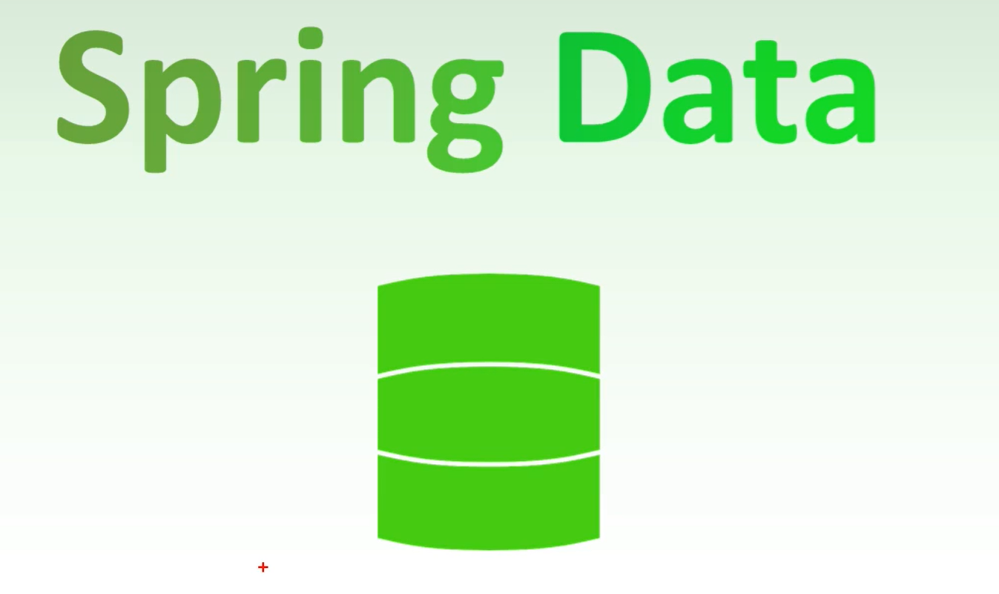

## 一、SpringData

- SpringData致力于为数据访问层，(DAO)提供统一的基于Spring的编程模版
对于每一种持久性存储，都需要为其搞一套CRUD（创建-读取-更新-删除），SpringData提供了一个通用的接口和模版

总结：简化开发-统一

## 二、SpringData JPA
### 1.简介
- JPA全称 Java Persistence API(2019年重命名成 Jakarta ...) ,是一种ORM规范
表和实体的一个映射

- **相同处**
1. JPA是JDBC的升级版
2. JDBC和JPA都是一种规范
3. 都是SUN推出的

- **不同处**
1. JDBC是由各个关系型数据实现的，JPA是有ORM框架实现的
2. JDBC使用 SQL语句和数据库通信，JPA用面向对象方式，通过ORM框架来生成SQL，进行操作
3. JPA在JDBC之上的，JPA也要以来JDBC才能操作数据库

简单理解就是以面向对象的方式去和数据库交流，不需要面向sql

### 2.规范提供
>**ORM映射元数据**：JPA支持**XML**和**注解**两种元数据方式，元数据描述对象和表之间的映射关系，框架据此将实体对象持久化到数据库表中。
eg：`@Entity`、`@Table`、`@Id`与`@Column`等注解
**JPA的API**：用来操作实体对象，执行CRUD操作，框架在后台替我们完成所有的事情，开发者从琐碎的JDBC和SQL代码中解脱出来。
eg: `entityManager.merge(T t);`
**JPQL查询语言**：通过面向对象而非面向数据的查询语言查询数据，避免程序的SQL语句紧密耦合。
eg: `from Student s where s.name=?`   Student- 类名

### 3.Hibernate与JPA
待更...