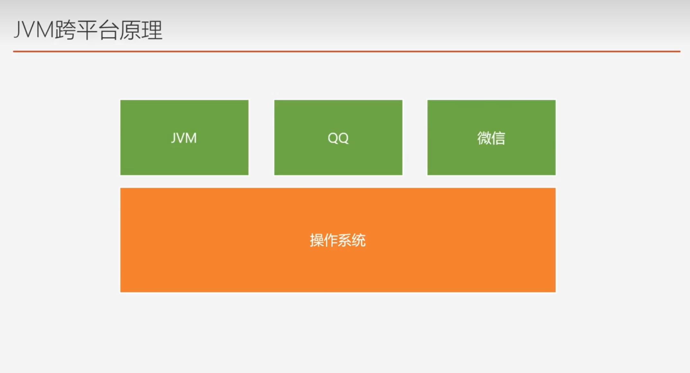
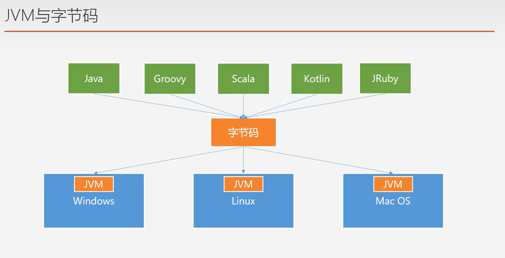
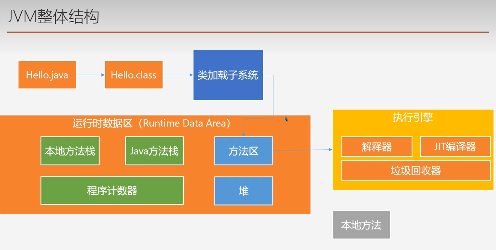
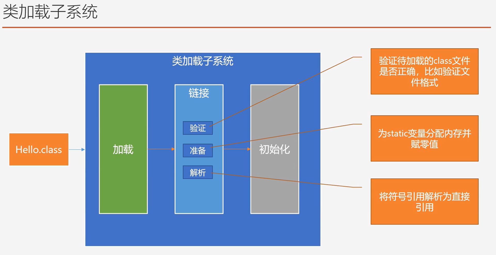
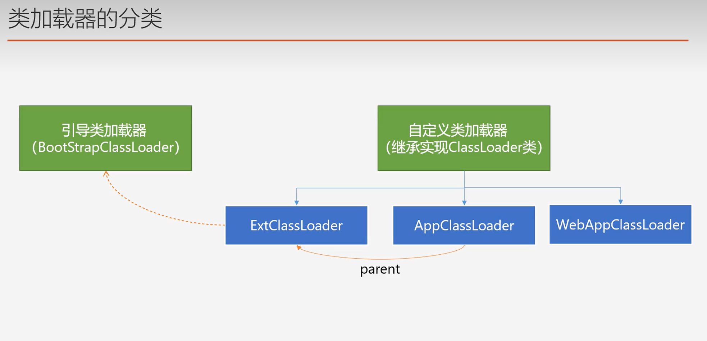
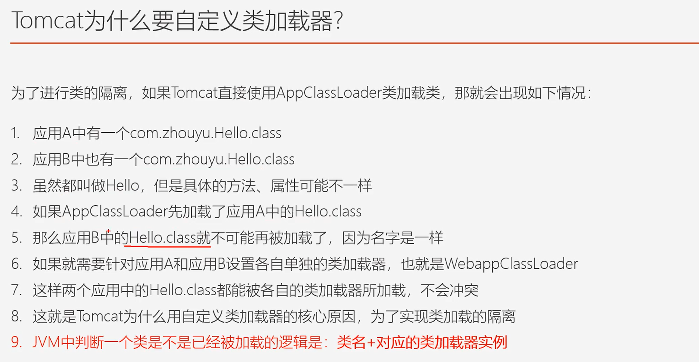
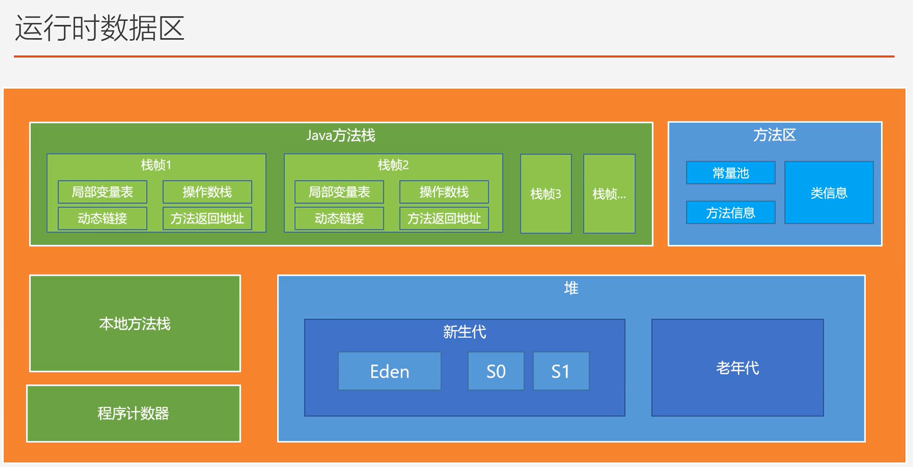
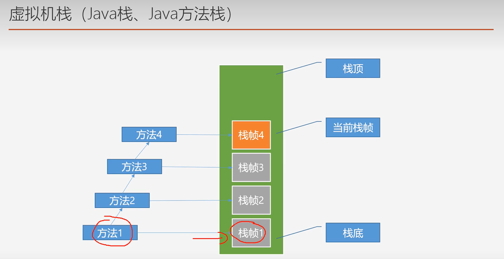
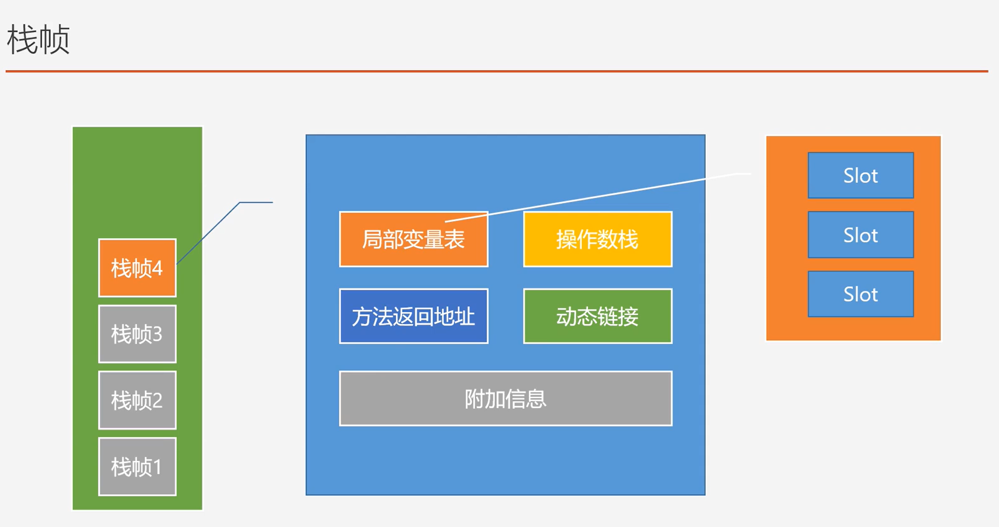

## 一、JVM跨平台
### 1.JVM原理

Java代码->变异成字节码->解释成机器指令
### 2.JVM与字节码



## 二、JVM整体结构

### 1.JIT编译器
**JIT编译器：JIT（Just-In-Time）编译器是一种将源代码或中间代码在运行时动态编译成机器码的编译器。**与传统的静态编译器不同，JIT 编译器将编译过程推迟到程序运行时刻。
JIT 编译器在程序执行时根据需要进行编译，将**热点代码（频繁执行的代码路径）编译为高效的机器码**，从而减少解释执行带来的性能损失。它还可以进行优化，如内联函数调用、消除冗余代码等，以进一步提升程序性能。
>常见的使用 JIT 编译器的语言包括 Java（通过 HotSpot JVM）、.NET（通过.NET JIT 编译器）、JavaScript（通过 V8 引擎）等。这些语言的执行环境都使用了 JIT 编译器来提高程序的性能。
### 2.本地方法栈
native method 在java中定义的方法，但由其他语言实现

### 3.类加载子系统
经典面试题....来了 类加载过程（面试篇有讲）

解析阶段较难理解： 将名字  转换成 真正的地址
#### 1）类加载器分类

>extclassloader:jre/lib/ext
appclassloader: classpath

这块还有个双亲委派  App——>Ext——>BootStrap
- 避免类的重复加载，防止核心API被篡改（没加载就记载，加载了就不重复了，有点像言多必有失）
#### 2）Tomcat 使用自定义类加载器的主要原因如下：

**动态加载**：Tomcat 作为一个 Web 服务器，需要在运行时动态加载和卸载 Web 应用程序。通过使用自定义类加载器，**可以实现独立的类加载环境，每个 Web 应用程序都有自己的类加载器，从而实现应用程序间的隔离和解耦**。

**热部署**：自定义类加载器还能够支持热部署功能，即在不重启服务器的情况下，替换更新的类文件。这对于开发和调试阶段非常有用，可以节省开发时间。

**类加载隔离**：Tomcat 支持部署多个 Web 应用程序，这些应用程序可能使用相同的类或库文件，但每个应用程序可能有不同的版本或定制化的需求。通过使用自定义类加载器，可以实现每个应用程序独立的类加载环境，避免类冲突和版本冲突的问题。

**安全性**：自定义类加载器还能够增强应用程序的安全性。例如，可以使用自定义类加载器对从用户上传的类文件进行检查和验证，以防止恶意代码的执行。

总之，Tomcat 使用自定义类加载器**可以提供动态加载、热部署、类加载隔离和安全性等优势**，以满足不同应用场景下的需求，并提升服务器的灵活性和可靠性。



### 4.运行时数据区


#### 1）程序计数器
PC Register 程序计数寄存器
- 物理寄存器的抽象实现
- 记录待执行的下条指令
- 程序控制流指示器，循环、if-else、异常处理、线程恢复等都依赖他完成
- 唯一一个在JVM规范中没有任何规定任何OutOfMemoryError情况的区域

#### 2）虚拟机栈

>每个线程创建时会创建一个虚拟机栈，栈内有一个个的栈帧，每个栈帧对应一个方法
>>虚拟机线程是私有的
不需要垃圾回收哦，（执行完就出栈）
线程太多的话会有OutOfMemoryError的情况，内存不够用啦！
方法调用层次太多，会出现StackOverflowError
可以通过-Xss来设置虚拟机栈大小

##### 栈帧内部结构



#### 3）堆区 JVM中最重要一块  新生代——老年代  GC

堆区（Heap）是Java虚拟机（JVM）运行时数据区域之一，用于**存储对象实例和数组**。在Java程序中，**通过关键字 `new` 创建的对象都会被分配到堆区内存中。**

以下是堆区的一些特点：
- 动态分配：堆区是动态分配和释放内存的，它不需要在编译时确定大小，而是**根据程序运行时的需求进行动态分配。**
- 对象存储：堆区主要用于存储对象实例和数组，对象的成员变量也存储在堆区中。
- 垃圾回收：堆区通过垃圾回收器（Garbage Collector）自动管理内存。**当对象不再被引用时，垃圾回收器会自动回收**这些对象所占用的内存空间。
- 分代结构：堆区通常被划分为几个不同的代（Generation），如**新生代（Eden Space、Survivor Space）和老年代（Tenured/Old Generation）**。这是为了更高效地进行垃圾回收和内存管理。
- 存储特点：堆区的**存储是无序的**，对象的分配和释放都是在堆的任意位置进行的。

需要注意的是，虽然堆区具有动态分配内存的特点，但是过度频繁的对象创建和销毁，以及堆区内存的不正确管理，可能会导致内存溢出（OutOfMemoryError）或性能下降的问题。因此，在开发Java应用程序时，需要合理地管理堆区内存，避免过度使用和浪费。

---

##### 修改参数改变大小
在Java中，可以使用命令行参数或JVM参数来修改堆大小。

>**命令行参数：**
>>通过在运行Java程序时使用 -Xms 和 -Xmx 参数，可以分别设置堆的初始大小和最大大小。
`-Xms<size>`：设置初始堆大小。例如，-Xms512m 表示初始堆大小为 512MB。
`-Xmx<size>`：设置最大堆大小。例如，-Xmx1024m 表示最大堆大小为 1024MB。
示例命令：
`java -Xms512m -Xmx1024m MyApp`

>**JVM参数：**
>>使用 JVM 参数可以在代码中动态地修改堆大小。
`Runtime.getRuntime().totalMemory()` 返回当前Java虚拟机堆内存的总量。
`Runtime.getRuntime().maxMemory()` 返回Java虚拟机堆内存的最大量。

示例代码：
```java
public class HeapSize {
    public static void main(String[] args) {
        long totalMemory = Runtime.getRuntime().totalMemory(); // 当前堆内存总量
        long maxMemory = Runtime.getRuntime().maxMemory();     // 最大堆内存量
        System.out.println("Total Memory: " + totalMemory);
        System.out.println("Max Memory: " + maxMemory);
    }
}
```

---

##### 新生代和老年代   2:1
>新生代中：
Eden区:S0:S1   =   8:1:1 (默认情况)

>老年代的意思就是： 经过几次垃圾回收还活着的老东西.....

**Eden Space**（伊甸区）是Java堆的一部分，也称为新生代（Young Generation）中的一个区域。它是存储新创建的对象的初始位置。

在Java的垃圾回收过程中，当使用关键字 `new` 创建新的对象时，这些**对象会首先被分配到伊甸区**。伊甸区大小通常占整个新生代的一部分，**其余部分为两个Survivor Space（幸存者区）**。

Eden区的主要特点包括：
对象分配：新创建的对象首先在伊甸区进行分配。
**Minor GC**：如果Eden区满了，垃圾回收器会触发一次 Minor GC（年轻代垃圾回收），回收伊甸区和幸存者区中不再被引用的对象。
存活对象：经过一次 Minor GC 后，仍然存活的对象将被移动到幸存者区。
对象晋升：如果对象在幸存者区经历了多次垃圾回收后仍然存活，则会被晋升到老年代（Tenured Generation）。

>如果对象过大可能会直接从Eden区到老年区   或者创建时候直接到老年区

设置伊甸区的大小可以通过 JVM 参数进行调整，例如，使用 `-XX:NewRatio` 参数可以指定新生代与老年代的比例，默认值为 2
示例命令：`java -XX:NewRatio=2 MyApp`

---
##### GC垃圾回收
- Young GC / Minor GC：负责对新生代进行垃圾回收
- Old GC / Major GC：负责对老年代进行垃圾回收，目前只有CMS垃圾收集器会单独对老年代进行垃圾回收，其他垃圾回收是整堆回收顺带老年回收了
- Full GC：整堆回收，也会对堆方法区回收

#### 4）为啥JVM整个垃圾回收？

