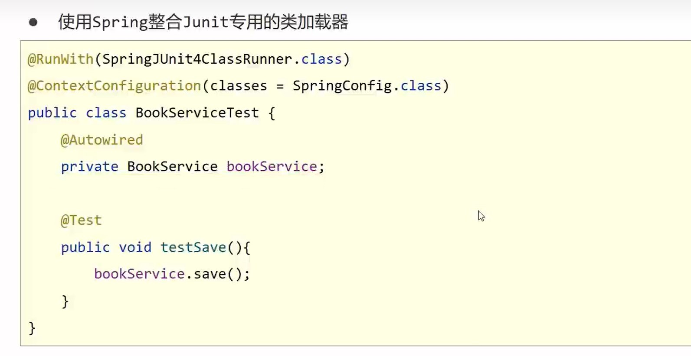

# Spring


## 一、广义的 Spring
- 有多个不同的子项目:
Spring FrameWork（其他子项目的基础）、Spring MVC、SpringBoot、Spring Cloud、 Spring Data、Spring Security
## 二、狭义的 Spring：SPring FrameWork
- Spring框架是一个分层的、面向切面的java应用程序的一站式轻量级解决方案
Spring 有两个最核心模块：IOC和AOP
>IoC：（Inverse of Control）,"控制反转"，指把创建对象过程交给Spring管理
AOP：(Aspect Oriented Programming),译为"面向切面编程"，AOP用来封装多个类的公共行为，将那些与业务无关，却为业务模块所共同调用的逻辑封装起来、减少系统的重复代码、降低模块间耦合度。另外，AOP还解决一些系统层面上的问题，比如日志、事务、权限等。

## 三、Spring 特性
- 非侵入式：基于Spring开发的应用中的对象可以不依赖于Spring的API
- 控制反转：IOC——Inversion of Control，指的是将对象的创建权交给 Spring 去创建。使用 Spring 之前，对象的创建都是由我们自己在代码中new创建。而使用 Spring 之后。对象的创建都是给了 Spring 框架。
- 依赖注入：DI——Dependency Injection，是指依赖的对象不需要手动调用 setXX 方法去设置，而是通过配置赋值。
- 面向切面编程：Aspect Oriented Programming——AOP
- 容器：Spring 是一个容器，因为它包含并且管理应用对象的生命周期
- 组件化：Spring 实现了使用简单的组件配置组合成一个复杂的应用。在 Spring 中可以使用XML和Java注解组合这些对象。
- 一站式：在 IOC 和 AOP 的基础上可以整合各种企业应用的开源框架和优秀的第三方类库（实际上 Spring 自身也提供了表现层的 SpringMVC 和持久层的 Spring JDBC）

## 四、IoC如何使用返回创建的对象
先写user类，之后配置xml，再在其他类用ioc创建
```java
package org.atguigu.spring6;
// User类
public class User {
    public User(){
        System.out.println("无参构造");
    }
    public void add(){
        System.out.println("add ...");
    }
    public static void main(String[] args) {

    }
}
```
```xml
<!-- bean.xml文件 -->
<?xml version="1.0" encoding="UTF-8"?>
<beans xmlns="http://www.springframework.org/schema/beans"
       xmlns:xsi="http://www.w3.org/2001/XMLSchema-instance"
       xsi:schemaLocation="http://www.springframework.org/schema/beans http://www.springframework.org/schema/beans/spring-beans.xsd">

<!--    完成user对象创建
        bean标签
            id属性 ：唯一标识
            class属性：要创建对象所在类的全路径（包名称=类名称）
       -->
    <bean id="user" class="org.atguigu.spring6.User"></bean>
</beans>
```
>1. 加载bean.xml配置文件
2. 对xml文件进行解析操作
3. 获取xml文件bean标签属性值 id属性值和class属性值
4. 使用反射根据类全路径创建对象
```java
package org.atguigu.spring6;

import org.junit.jupiter.api.Test;
import org.springframework.context.ApplicationContext;
import org.springframework.context.support.ClassPathXmlApplicationContext;

public class TestUser {
    @Test
    public void testUserObject(){
        //加载spring配置文件，对象创建
        ApplicationContext context = new ClassPathXmlApplicationContext("bean.xml");
        // 获取创建的对象
        User user = (User) context.getBean("user");
        System.out.println(user);
        //使用对象调用方法进行测试
        user.add();
    }
    //反射创建对象
    @Test
    public void testUserObject1() throws Exception{
        //获取Class对象
        Class clazz = Class.forName("org.atguigu.spring6.User");
        //调用方法创建对象
        //Object o = clazz.newInstance(); jdk9废除
        User user = (User) clazz.getDeclaredConstructor().newInstance();
        System.out.println(user);
        /*  无参构造
            org.atguigu.spring6.User@281e3708
         */
        }
}
```
- 创建的对象放到哪里？
源码里  `Map<String, BeanDefinition> `
`private final Map<String, BeanDefinition> beanDefinitionMap;`
## 五、Log4j2日志框架
1. 日志优先级
TRACE<DEBUG<INFO<WARN<ERROR<FATAL(严重错误)
    
### 简单配置 log4j2.xml
```xml
<?xml version="1.0" encoding="UTF-8"?>
<Configuration>
    <Appenders>
        <Console name="Console" target="SYSTEM_OUT">
            <PatternLayout pattern="%d{yyyy-MM-dd HH:mm:ss,SSS} %5p %c{1}:%L - %m%n" />
        </Console>
    </Appenders>
    <Loggers>
        <Root level="info">
            <AppenderRef ref="Console" />
        </Root>
    </Loggers>
</Configuration>
```
## 六、容器:IoC _及xml开发
- 由IoC容器管理的Java对象称为 **Spring Bean**，与使用关键字new创建的Java对象**没有任何区别**

- 把对象创建 和 对象与对象之间的关系 都交给了IoC
- 由主动new产生的对象由**外部**提供对象，此过程中对象创建控制权由程序转移到外部，此思想为**控制反转**

### 补充_ pom.xml中添加Spring相关的依赖项
```xml
<dependencies>
    <!-- Spring Core -->
    <dependency>
        <groupId>org.springframework</groupId>
        <artifactId>spring-core</artifactId>
        <version>5.3.9</version>
    </dependency>
    
    <!-- Spring Context -->
    <dependency>
        <groupId>org.springframework</groupId>
        <artifactId>spring-context</artifactId>
        <version>5.3.9</version>
    </dependency>
</dependencies>
```
- 这些依赖项将为你提供创建和管理Spring应用程序上下文的功能，其中包括从XML文件中读取和解析配置信息。你可以在创建Spring的ApplicationContext时，通过读取XML文件来配置和初始化Bean。这样，你就可以在XML文件中定义和配置你的应用程序组件。
- 请注意，实际上，Spring更加倾向于使用基于Java配置而不是XML配置。现代的Spring项目通常使用注解和Java类来配置应用程序。但是，如果你确实需要使用XML进行配置，Spring仍然支持并提供了相应的功能

- 导入此依赖后 右键创建xml文件即可出现 spring config字眼
### 1.IoC容器在Spring的实现
#### BeanFactory
IoC基本实现，是spring内部使用的接口，面向spring本身，不提供给开发人员
#### ApplicationContext
BeanFactory的子接口，提供了更多高级特性。面向spring的使用者。


### 2.DI（Dependency Injection）：依赖注入
- **在容器中建立bean与bean之间的依赖关系的整个过程**，称为依赖注入

- 依赖注入实现了控制反转的思想
- 指Spring创建对象的过程中，将对象依赖属性通过配置进行注入
依赖注入常见的实现方式两种：
>1.set注入
2.构造注入

>目标：充分解耦
>>使用IoC容器管理bean
>>再IoC容器内将有依赖关系的bean进行关系绑定
IoC就是一种控制反转的思想，DI是对IoC的一种具体实现。

### 3.bean实例化
#### 1）构造方法实例化bean_bean别名配置

```xml
<!--    配置bean-->
        <bean id="userDao" name="uname" class="org.example.dao.UserDao"></bean>
        <bean id="bookService" class="org.example.service.BookServiceImpl">
<!--                property 表示配置当前bean标签属性，name表示具体哪一个属性(bean中必须有set方法），ref表示参照哪个属性-->
                <property name="userDao" ref="uname"/>
<!--            ref可以参照name或者id-->
        </bean>
```
默认获取的对象为单例模式（两个对象内存一个地址），可以更改bean scope配置

#### 2）使用静态工厂实例化bean
- ApplicationContext.xml配置
```xml
<!--    class配置factory的,method写定义的方法即可-->
        <bean id="orderDao" class="org.example.factory.OrderFactory" factory-method="getOrderDao"></bean>
```
- 工厂类 OrderFactory.java
```java
package org.example.factory;

import org.example.service.OrderDao;
import org.example.service.impl.OrderDaoImpl;

public class OrderFactory {
    public static OrderDao getOrderDao(){
        System.out.println("factory order dao");
        return new OrderDaoImpl();
    }
}
```
- 启动类 AppFactory.java
```java
package org.example;

import org.example.service.OrderDao;
import org.springframework.context.ApplicationContext;
import org.springframework.context.support.ClassPathXmlApplicationContext;

public class AppFactory {
    public static void main(String[] args) {
        ApplicationContext ctx = new ClassPathXmlApplicationContext("ApplicationContext.xml");
        OrderDao orderDao = (OrderDao) ctx.getBean("orderDao");
        orderDao.save();
    }
}
// 输出 factory order dao
//  order dao save...
```
#### 3）实例工厂实例化bean

改进后：
#### 4）FactoryBean方式

- isSingleton方法可以改变是否是单例对象

### 4.bean生命周期
- UserDaoImpl.java
```java
package org.example.dao.impl;

import org.example.dao.UserDao;

public class UserDaoImpl implements UserDao {
    public void save(){
        System.out.println("user dao save");
    }
    //bean初始化对应的操作
    public void init(){
        System.out.println("userdao init");
    }
    //bean销毁前对应的操作
    public void destory(){
        System.out.println("userdao destory");
    }
}
```
- xml配置,加上init-method，destory-method
```xml
<?xml version="1.0" encoding="UTF-8"?>
<beans xmlns="http://www.springframework.org/schema/beans"
       xmlns:xsi="http://www.w3.org/2001/XMLSchema-instance"
       xsi:schemaLocation="http://www.springframework.org/schema/beans http://www.springframework.org/schema/beans/spring-beans.xsd">
<!--    1.导入坐标 spring-context-->

<!--    2.配置bean-->
        <bean id="userDao" name="uname" class="org.example.dao.impl.UserDaoImpl" init-method="init" destroy-method="destory"></bean>
        <bean id="bookService" class="org.example.service.impl.BookServiceImpl">
<!--                property 表示配置当前bean标签属性，name表示具体哪一个属性(bean中必须有set方法），ref表示参照哪个属性-->
                <property name="userDao" ref="uname" />
<!--            ref可以参照name或者id-->
        </bean>
<!--    class配置factory的,method写定义的方法即可-->
        <bean id="orderDao" class="org.example.factory.OrderFactory" factory-method="getOrderDao"></bean>
</beans>
```

- 输出结果
```
userdao init
factory order dao
order dao save...
```
### 5.注入
#### 1）setter注入
- 有对应的 num属性及setter方法，配合以下配置
`  <property name="num" value="1"></property>`

#### 2）构造器注入
`<constructor-arg name="num" value="100"></constructor-arg>`
为了降低耦合，不局限于对应的名字，可以用index="0",
`<constructor-arg index="0" value="100"></constructor-arg>`

#### 3）自动装配
autowire属性 
主要是引用类型装配
#### 4）集合注入
property   list  set   map(key-value),用entry

### 6.Spring管理第三方资源
- DruidDataSource
- ComboPooledDataSource   c3p0


### 7.加载properties


## 七、Spring命名空间
- Spring命名空间是**一种在Spring框架中配置和声明Bean的方式。**它提供了一种简化配置的方式，可以使用特定的XML命名空间和预定义的标签来定义Bean以及它们之间的关系和行为。

>使用Spring命名空间，可以更加简洁和可读性强的方式配置和管理Spring应用的组件。以下是一些常用的Spring命名空间及其功能：
>>`<bean>`命名空间：**用于定义和配置Bean。**可以通过指定`<bean>`标签的id和class属性，来声明和创建Bean实例。
`<context>`命名空间：**用于配置Spring应用的上下文环境。**包括配置自动扫描组件、注入依赖、AOP、事务等。
`<aop>`命名空间：**用于配置切面和面向切面的编程。**可以使用`<aop:config>`标签来定义切面和通知，以及切入点和切面的关系。
`<tx>`命名空间：**用于配置Spring的事务管理。**可以使用`<tx:annotation-driven>`标签启用基于注解的事务功能，还可以通过配置`<tx:advice>`标签来定义事务通知。
`<mvc>`命名空间：**用于配置Spring MVC框架。**可以使用`<mvc:annotation-driven>`标签启用注解驱动的Spring MVC功能，还可以使用`<mvc:view-resolvers>`标签配置视图解析器等。

>除了上述命名空间，还有一些其他的命名空间可以用于配置Spring相关的功能，如缓存、安全等。使用Spring命名空间，可以通过更简单的方式配置和管理Spring应用的各个组件，提高开发效率并降低配置复杂性。

## 八、容器总结_以上总结
### 1.获取容器

### 2.获取bean

### 3.bean相关

### 4.依赖注入相关


## 九、注解开发

### 1.注解开发定义


### 2.三个衍生注解


### 3.纯注解开发
- spring3.0可纯注解开发


### 4.注解开发bean作用范围，生命周期


### 5.注解开发依赖注入
#### - 自动装配
##### 1）@Autowire 暴力反射 自动装入引用类型

##### 2）@Qualifier指定bean名字

##### 3）@value简单类型注入
#### - 读取properties文件 @PropertySource


### 6.第三方bean管理
- 独立配置,逻辑拆开
```java
@Configuration
public class JdbcConfig {
    @Bean //表示返回是一个bean
    public DataSource dataSource() {
        DruidDataSource ds = new DruidDataSource();
        ds.setDriverClassName("com.mysql.jdbc.Driver");
        ds.setUrl("jdbc:mysql://localhost:3306/spring_db");
        ds.setUsername("root");
        ds.setPassword("123456");
        return ds;
    }
}
```
```java
@Configuration
//第一种扫描式
@ComponentScan("org.example.config")

// 第二种导入式
@Import({JdbcConfig.class})
public class SpringConfig {
}
```

## 十、注解开发总结
### 1.XML配置 对比 注解配置


## 十一、Spring整合Mybatis
### 1.Mybatis程序核心对象分析
- 核心 SqlSessionFactory

### 2.整合Mybatis
- SqlSessionFactoryBean
- MapperScannerConfigurer
1:

2:


### 3.整合JUnit
- `@RunWith` 注解是JUnit框架提供的一个注解，用于指定测试运行器（Runner）。测试运行器负责调用测试用例的执行，并提供附加的功能和扩展。

>在JUnit 4中，常见的测试运行器有：
>>`BlockJUnit4ClassRunner：`默认的测试运行器，用于执行JUnit 4风格的测试用例。
`Parameterized：`用于执行参数化测试，允许对测试用例使用不同的输入参数进行多次运行。
`SpringJUnit4ClassRunner：`与Spring框架集成的测试运行器，用于运行基于Spring的测试用例。
在JUnit 5中，`@RunWith` 注解已经被 `@ExtendWith` 注解取代。JUnit 5使用扩展模型（Extension Model）来提供测试运行器的功能。可以通过 `@ExtendWith `注解来指定扩展，来实现类似的功能。

- 请注意，使用 `@RunWith` 注解或 `@ExtendWith `注解取决于你所使用的JUnit版本。


## 十二、AOP 面向切面编程

### 1. 简介
- **AOP（Aspect Oriented Programming）面向切面编程**:一种编程范式、指导开发者**如何组织程序结构**
- **作用：****在不惊动原始设计的基础上为其进行功能增强**
- Spring理念：无入侵/侵入式

### 2.AOP 核心概念
- 
- 

### 3.AOP入门案例
#### 1）导入aop相关坐标


#### 2）定义dao接口与实现类
```java
package org.example.dao; 
// 接口
public interface BookDao {
    void save();
    void update();
}
```
```java
package org.example.dao.impl;

import org.example.dao.BookDao;
import org.springframework.stereotype.Repository;
//实现类
@Repository
public class BookDaoImpl implements BookDao {
    @Override
    public void save() {
        System.out.println(System.currentTimeMillis());
        System.out.println("book dao save......");
    }

    @Override
    public void update() {
        System.out.println("update......");
    }
}
```
#### 3）4）5）6）定义通知类
```java
package org.example.aop;

import org.aspectj.lang.annotation.Aspect;
import org.aspectj.lang.annotation.Before;
import org.aspectj.lang.annotation.Pointcut;
import org.springframework.stereotype.Component;

@Component
@Aspect //第6步  告诉spring这个注解做aop
public class MyAdvice {//第3步 定义通知类
    @Pointcut("execution(void org.example.dao.BookDao.update())")   //第4步  定义切入点
    private void pt(){} // 切入点定义依托一个不具有实际意义的方法进行，即无参数，无返回值，方法体无实际逻辑

    @Before("pt()")  //第5步  绑定切入点和通知关系，并指定通知添加到原始连接点的具体执行位置
    public void method(){
        System.out.println(System.currentTimeMillis());
    }
}
```
#### 7）开启Spring对AOP注解驱动支持
```java
@Configuration
@ComponentScan("org.example")
@EnableAspectJAutoProxy  //第7步 告诉有用注解开发aop,开启Spring对AOP注解驱动支持
public class SpringConfig {
}
```
#### 8）启动测试
```java
public class App {
    public static void main(String[] args) {
        ApplicationContext ctx = new AnnotationConfigApplicationContext(SpringConfig.class);
        BookDao bookDao = ctx.getBean(BookDao.class);
        bookDao.update();
    }
}
/*  结果
1688105568022
update......
*/
```
---

### 4.工作流程及核心
- 如果匹配上响应切入的点，就造proxy，否则原始对象
- 目标对象(Target):原始功能去掉共性功能对应的类产生的对象，这种对象是无法直接完成最终工作的
- 代理（Proxy）：目标对象无法直接完成工作，需要对其进行功能回填，通过原始对象的代理对象实现
### 5.AOP切入点表达式
- 切入点：要进行增强的方法
- 切入点表达式：要进行增强的方法的描述方式


- 通配符使用
- ..为任意的意思


### 6.AOP通知类型

- `@Before`    `@After`     `@Around`（常用，重点） `@AfterReturning`（原始切入点方法正常 运行完才运行）       `@AfterThrowing`(方法出异常才运行)
- 环绕通知的返回值细节，可以用pjp.proceed();接收，遇到不同类型可强转


### 7.业务层接口执行效率
- proceed 继续进行 继续前进的意思

- 测试接口 执行效率仅仅是理论值，并不是完整一次过程

### 8.AOP通知获取数据
- 获取参数


- 获取返回值


- 获取异常数据


## 十三、AOP总结

### 1.AOP总结_切入点

### 2.AOP总结_通知类型

### 3.AOP总结_获取参数和返回值
