# SSM常用注解
- 在SSM（Spring + Spring MVC + MyBatis）框架中，有很多常用的注解用来简化配置和增强开发效率。以下是一些常用的注解：
>`@Component`：用于标识一个普通的Java类为Spring容器的组件。
`@Controller`：用于标识一个类为Spring MVC的控制器。
`@RequestMapping`：用于映射请求路径到控制器的处理方法。
`@Service`：用于标识一个类为服务层的组件，用于定义业务逻辑。
`@Repository`：用于标识一个类为持久层的组件，通常用于访问数据库。
`@Autowired`：用于自动注入依赖，可以用在构造方法、属性或方法上。
`@Qualifier`：结合@Autowired使用，用于指定注入的Bean的名称。
`@Value`：用于注入属性值。
`@RequestParam`：用于获取请求参数的值。
`@ResponseBody`：用于将方法返回的对象转换为指定的格式（如JSON）并响应给客户端。
`@PathVariable`：用于获取请求路径中的占位符的值。
`@Valid`：用于开启方法参数的校验。
`@Transactional`：用于标识一个方法或类需要进行事务管理。
`@Aspect`：用于定义切面（Aspect）。
`@Pointcut`：用于定义切入点（Pointcut）。

## 一、事务
- @Transactional
- mybatis内部使用jdbc的事务，事务主要是为了同成功或者同失败，eg：银行转账，并记录日志

- 事务管理员：发起事务方    开启事务的方法
- 事务协调员：加入事务方，通常为   数据层方法，也可以是业务层方法

- 事务传播
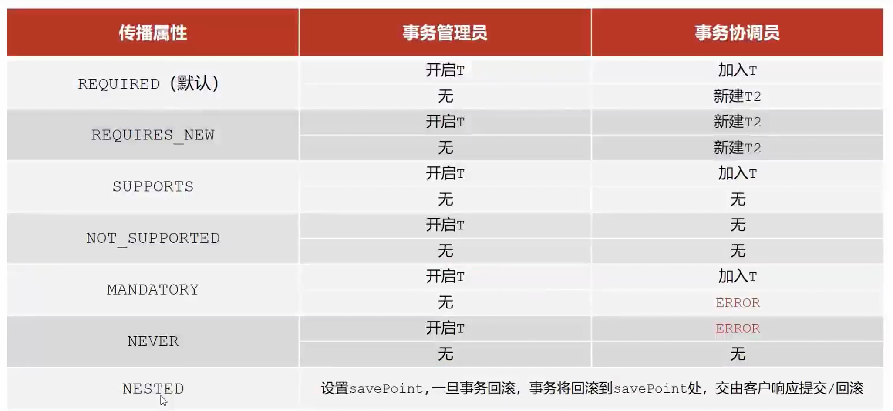

## 二、SpringMVC

### 1.SpringMVC概述
- SpringMVC是一种基于Java实现MVC模型的轻量级Web框架
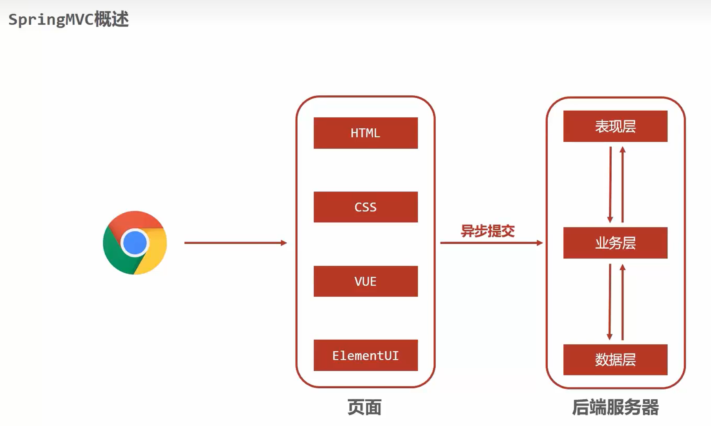

### 2.bean加载控制
- 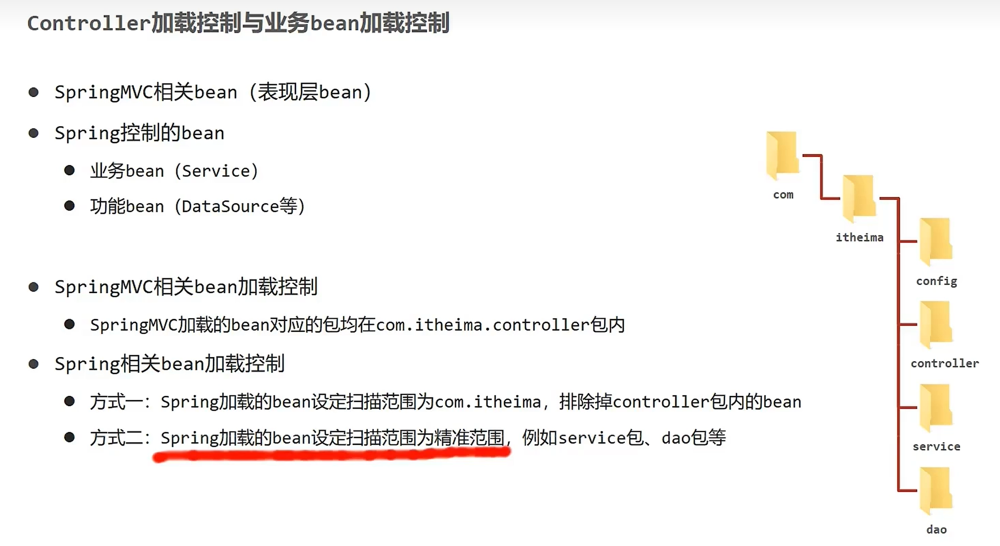
- 主要有excludeFilters， includeFilters
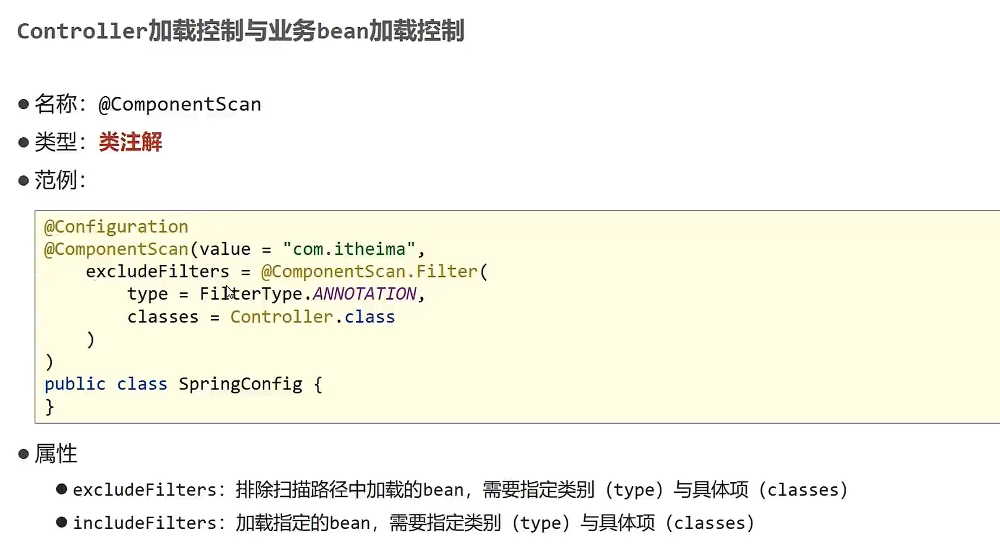

#### 白学之路——化简了
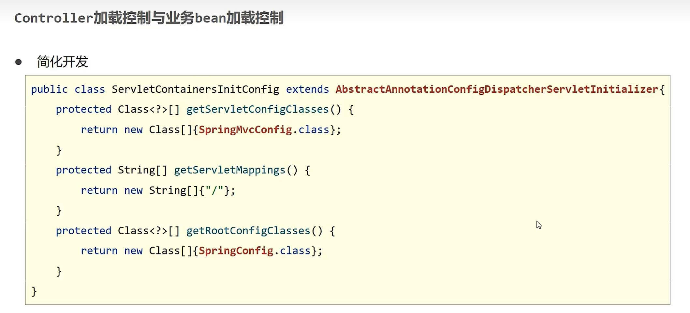

### 3.设置请求映射路径
- 为了避免冲突
- /user/save
- /book/save

### 4.json数据传递参数
- @RequestBody和@RequestParam的区别
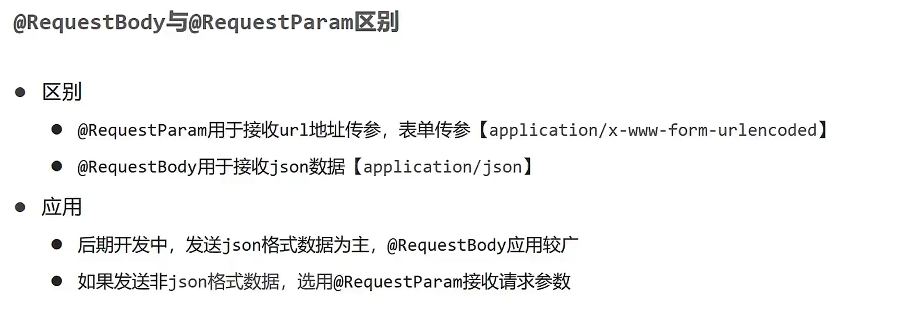

## 三、jetty服务器_切换web服务器
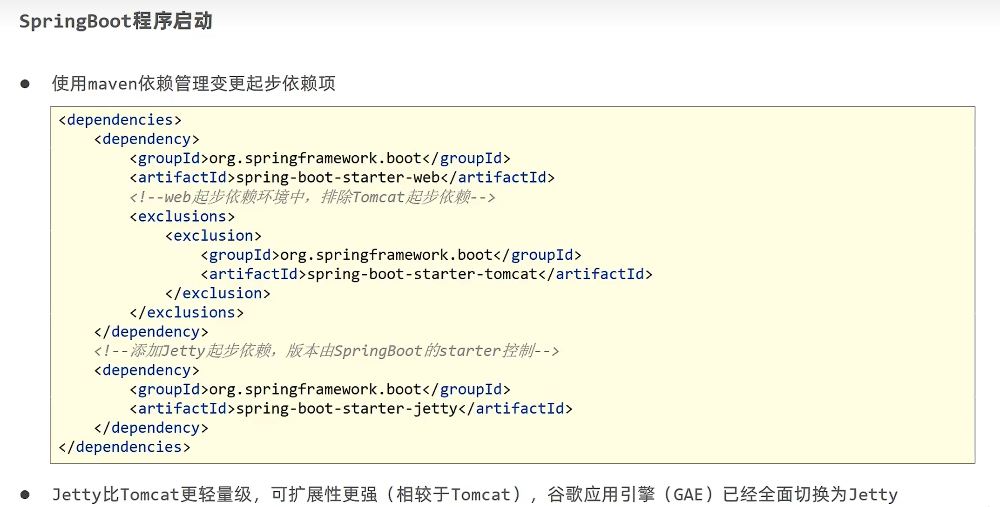

## 四、三种配置文件格式
### 1.优先级及格式配置
 - 优先级：`application.yml`  < `application.yaml` < `application.properties`
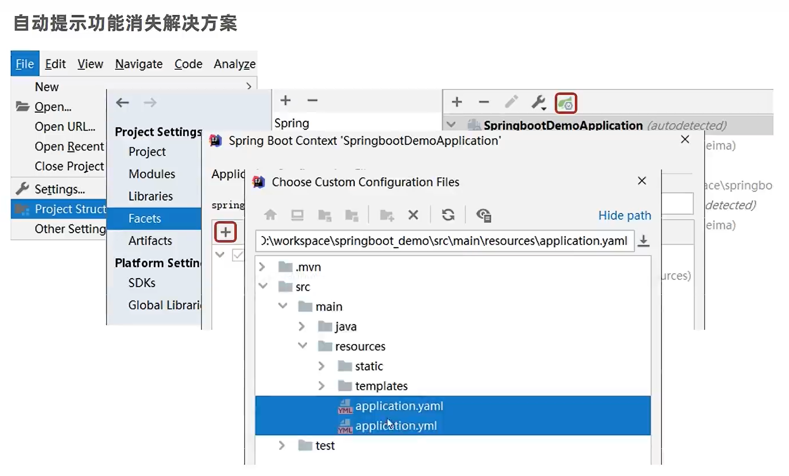
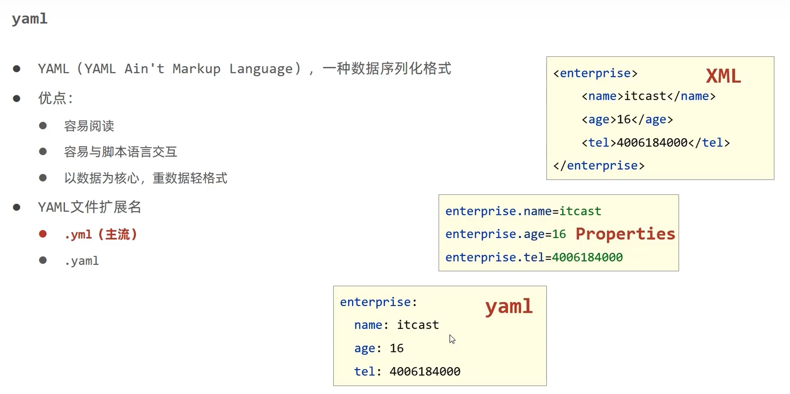

### 2.yaml语法
 >yaml主流-数据序列化格式，下面为语法格式
 >>1.大小写敏感
2.属性层级关系使用多行描述，每行结尾使用冒号（：）结束
3.使用缩进表示层级关系，同层级左侧对齐，只允许空格（不允许用tab）
4.属性值前面添加空格（属性名和属性值之间用 冒号+空格 分隔
5.# 表示注释

### 3.读取方式
>数据读取 ： `@Value(${..})`   ,
 自定义封装的指定数据  `@ConfigurationProperties(prefix="enterprise")` ,
 Environment

## 五、 多环境开发配置
### 1.基础配置，多环境启动
- 带划线的为过时的
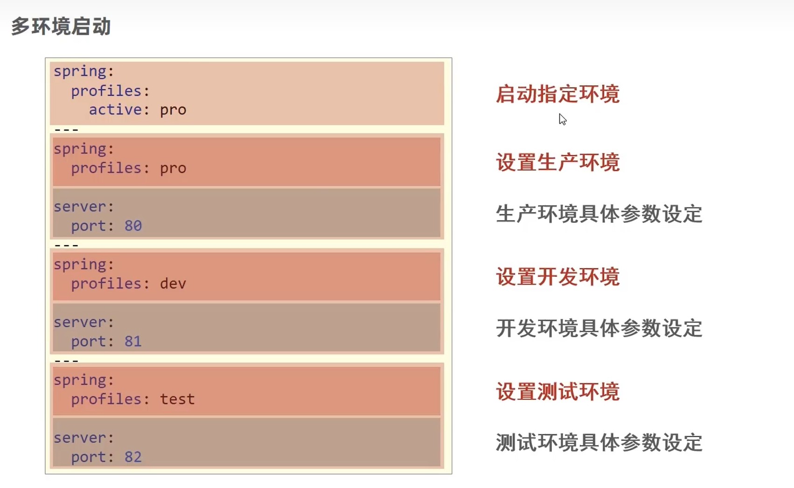

### 2.propertie多环境启动_承接上面
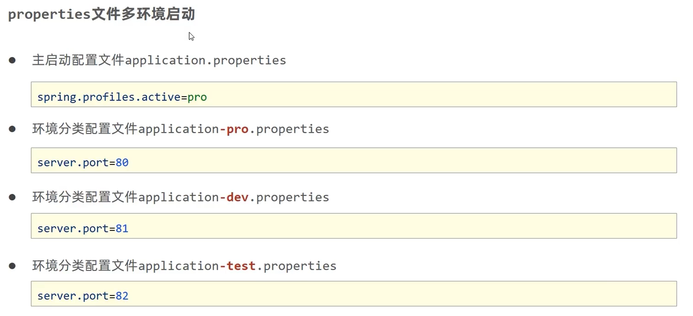

### 3.配置文件分类
- config文件夹下的配置文件优先级更高
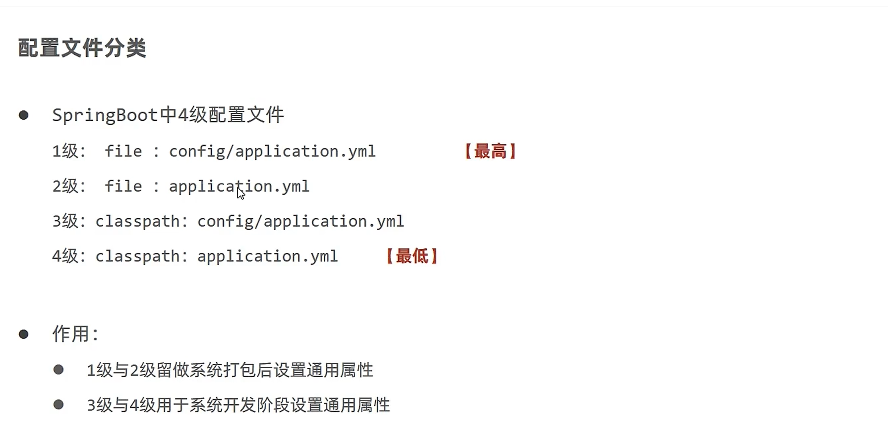