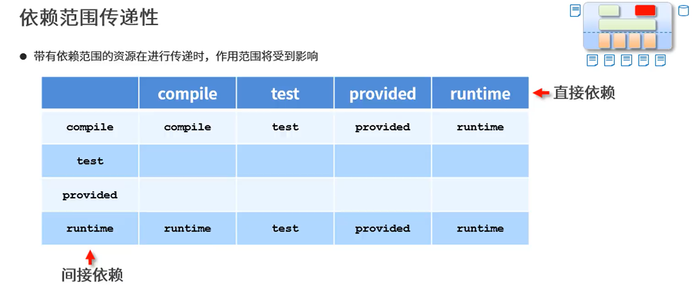
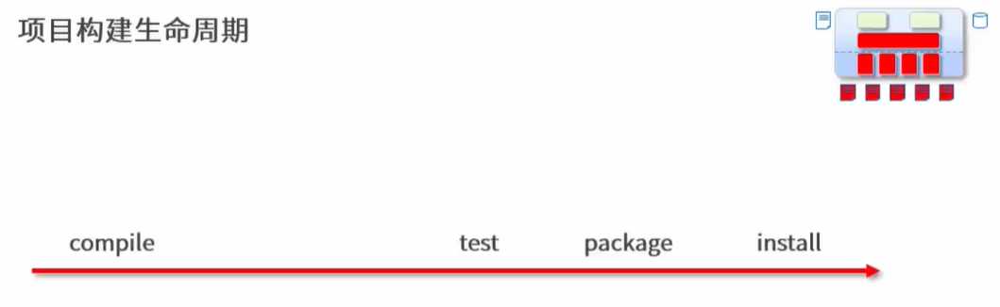

# Maven大一统
## 一、简介
- Maven的本质是一个项目管理工具，将项目开发和管理过程抽象成一个项目对象模型（POM）
- POM （Project Object Model）：项目对象模型

### 作用
- 项目构建、依赖管理（管jar包，避免版本冲突）
- 统一了开发结构

 蓝色文件夹为源码，绿色为test

## 二、依赖管理
### 依赖传递冲突问题
 - 路径优先：层次浅的优先级高
 - 声明优先：资源在同级被依赖时，配置顺序靠前的优先
 - 特殊优先：同级配置了相同资源的不同版本，后配置覆盖先配置的
 
 个人理解 最近的
 ```xml
 <!--  可选依赖 dependency中，类似于私房钱，让不让别人知道 -->
 <optional>true</optional>
 <!-- 排除依赖，主动断开与其他的联系 -->
 <exclusions>
    <exclusion>
        <groupId>org.junit.jupiter</groupId>
        <artifactId>junit-jupiter-api</artifactId>
    </exclusion>
 </exclusions>
 ```

### 依赖范围
- 依赖的jar默认情况可以 在任何地方使用，可以通过scope标签设定作用范围
>作用范围
>>主程序范围有效（main文件夹范围内）
测试程序范围有效（test文件夹范围内）
是否参与打包（package指令范围内）

这个servlet-api不参与打包因为服务器会有其api



## 三、项目构建生命周期


## 四、分模块开发与设计


- pom导资源坐标，需要先install 打包到自己的repository，其他的模块才能找到需要的依赖

## 五、聚合

>模块三种类型：
pom
jar
war
## 六、继承


- 子模块版本可以不写 用父的，便于维护，避免冲突
- 父pom.xml的配置`<dependencyManagement></dependencyManagement>`
plugins，同理

## 七、属性
### 1.自定义属性
```xml
<!-- 自定义属性 -->
<properties>
        <spring.version>5.1.9.RELEASE</spring.version>
        <junit.version>4.12</junit.version>
</properties>
```
其他地方版本写`<version>${**.version}</version>`即可。
### 2.内置属性
```xml
${basedir}
${version}
```
### 3.Setting属性
- 使用Maven配置文件setting.xml中的标签属性，用于动态配置
- 调用格式：`${settings.localRepository}`
### 4.Java系统属性
- 读取Java系统属性
- 调用格式：`${user.home}`
- 系统属性查询方式
```xml
mvn help:system
```

## 八、版本管理
### 1.工程版本
- SNAPSHOT(快照版本)-会不断更新，没成型
- RELEASE(发布版本)

每次打包install版本不一样的话，会生成不同的jar，文件夹可见不同
### 2.工程版本号约定
>约定规范
>>- <主板本>.<次版本>.<增量版本>.<里程碑版本>
>>- 主版本：表示项目重大架构变更，如spring5相对于spring4
>>- 次版本：表示有较大功能增加和变化，或者全面系统地修复漏洞
>>- 增量版本：表示有重大漏洞的修复
>>- 里程碑版本：表示一个版本的里程碑

>规范：5.1.9.RELEASE

## 九、多环境配置
### 1.多环境兼容
```xml
<!--    创建多环境-->
    <profiles>
<!--        定义具体环境、生产环境-->
        <profile>
<!--            定义环境对应的唯一名称-->
            <id>pro_env</id>
<!--            定义环境中换用的属性值-->
            <properties></properties>
        </profile>
<!--        定义具体环境、开发环境-->
        <profile>
            <id>dep_env</id>
            <properties></properties>
        </profile>
    </profiles>
```

### 2.加载指定环境
- 作用：加载指定环境配置
- 调用格式：
    `mvn 指令 -P 环境定义id`
- 范例：
    `mvn install -P pro_env`

## 十、跳过测试
>应用场景:
>>1.整体模块功能未开发
2.模块中某个功能未开发完毕
3.单个功能更新调试导致其他功能失败
4.快速打包
.....

_一般按部就班，否则可能面向慈善编程，（把用户权限提高，上线了免费使用....）_

## 十一、私服
### 1.安装


安装地址及教程
https://blog.csdn.net/i_r_o_n_m_a_n/article/details/120468285
### 2.私服资源获取

### 3.仓库分类
>宿主仓库hosted
>>保存无法从中央仓库获取的资源
>>>1.自主研发
2.第三方非开源项目

>代理仓库proxy
>>代理远程长裤，通过nexus访问替他公共仓库，录入中央仓库

>仓库组group
>>1.将若干个仓库组成一个群组，简化配置
2.仓库组不能保存资源，属于设计型仓库
