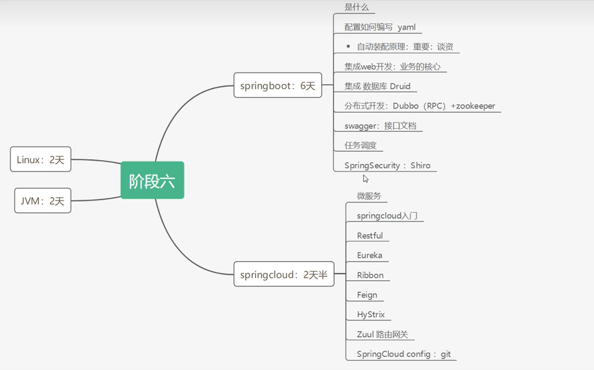

[SpringBoot自动配置原理](https://zhuanlan.zhihu.com/p/55637237)

Ctrl+shift+o 刷新maven
### 一、springboot项目启动不自动启动内嵌tomcat问题

pom.xml需要按照以下顺序配置

```xml
<dependencies>
    <!-- 这个dependcy放在最前面 -->
        <dependency>
            <groupId>org.springframework.boot</groupId>
            <artifactId>spring-boot-starter-test</artifactId>
            <scope>test</scope>
        </dependency>
        <dependency>
            <groupId>org.springframework.boot</groupId>
            <artifactId>spring-boot-starter-web</artifactId>
        </dependency>
    </dependencies>
```
---
### 二、重新编译启动项目
SPring Boot 提供  `spring-boot-devtools` 组件，使得无需手动重启Spring Boot应用即可重新编译启动项目，缩短编译启动时间
```xml
        <dependency>
            <groupId>org.springframework.boot</groupId>
            <artifactId>spring-boot-devtools</artifactId>
            <optional>true</optional>
        </dependency>
```

---
### 三、Web入门
- Spring Boot将传统Web开发的mvc、json、tomcat等框架整合，提供了spring-boot-starter-web组件，简化了Web应用配置。
- 创建SpringBoot项目勾选Spring Web选项后，会自动将spring-boot-starter- web组件加入到项目中。
- spring-boot-starter-web启动器主要包括web、webmvc、json、tomcat等基础依赖组件，作用是提供Web开发场景所需的所有底层依赖。
- webmvc为Web开发的基础框架，json为JSON数据解析组件，tomcat为自带的容器依赖。

---
### 四、控制器
- Spring Boot提供了`@Controller`和`@RestController`两种注解来标识此类负责接收和处理HTTP请求。
- 如果请求的是页面和数据，使用`@Controller`注解即可；如果只是请求数据，则可以使用`@RestController`注解。

---
### 五、RESTful API
互联网软件服务架构设计风格，基于这种架构理念和设计原则的 Web API更加简洁，更有层次
特点：
>1. 每一个URI代表一种资源
2. 客户端使用GET POST PUT DELETE四种操作方式对服务端资源进行操作
3. 通过操作资源的表现形式来实现服务端请求操作
4. 资源的表现形式是JSON 或 HTML
5. 客户端与服务端之间的交互在请求之间是无状态的，从客观户端到服务端的每个请求都包含必需的信息

两个关键特性：安全性、幂等性
### 六、Spring Boot 实现 RESTful API
- Spring Boot 提供的 spring-boot-starter-web 组件完全支持开发RESTful API，提供了与REST操作方式（GET\POST\PUT\DELETE）对应的注解
```java
@GetMapping
@PostMapping
@PutMapping
@DeleteMapping
@PatchMapping 处理PATCH请求，用于部分资源更新
```

---
### 七、Swagger
#### 1.解决报错版本匹配问题
```java
Spring Boot 2.6.x版本引入依赖 springfox-boot-starter (Swagger 3.0) 后，启动容器会报错
原因：
Springfox 假设 Spring MVC 的路径匹配策略是 ant-path-matcher，而 Spring Boot 2.6.x版本的默认匹配策略是 path-pattern-matcher，这就造成了上面的报错。
解决：
spring.mvc.pathmatch.matching-strategy=ant_path_matcher
```
#### 2.pom.xml配置
```xml
        <!-- https://mvnrepository.com/artifact/io.springfox/springfox-swagger2 -->
        <dependency>
            <groupId>io.springfox</groupId>
            <artifactId>springfox-swagger2</artifactId>
            <version>2.9.2</version>
        </dependency>
        <!-- https://mvnrepository.com/artifact/io.springfox/springfox-swagger-ui -->
        <dependency>
            <groupId>io.springfox</groupId>
            <artifactId>springfox-swagger-ui</artifactId>
            <version>2.9.2</version>
        </dependency>
```
#### 3.SwaggerConfig配置
```java
package com.example.helloworld.config;
import org.springframework.context.annotation.Bean;
import org.springframework.context.annotation.Configuration;
import springfox.documentation.builders.ApiInfoBuilder;
import springfox.documentation.builders.PathSelectors;
import springfox.documentation.builders.RequestHandlerSelectors;
import springfox.documentation.service.ApiInfo;
import springfox.documentation.spi.DocumentationType;
import springfox.documentation.spring.web.plugins.Docket;
import springfox.documentation.swagger2.annotations.EnableSwagger2;

@Configuration
@EnableSwagger2
public class SwaggerConfig {
    /**
     * 创建API应用
     * apiInfo() 增加API相关信息
     * 通过select()函数返回一个ApiSelectorBuilder实例,用来控制哪些接口暴露给Swagger来展现，
     * 本例采用指定扫描的包路径来定义指定要建立API的目录。
     * 多人开发可以设置多个Docket
     * @return
     */
    @Bean
    public Docket createRestApi() {
        return new Docket(DocumentationType.SWAGGER_2)
                .apiInfo(this.apiInfo())
                .groupName("***系统")
                //false 则不能在浏览器访问，true为默认。
                .enable(true)
                .select()
                //配置扫描接口的方式，基于包去扫描
                .apis(RequestHandlerSelectors.basePackage("com"))
                //paths()过滤什么路径
                .paths(PathSelectors.any())
                .build();
    }

    /**
     * 创建该API的基本信息（这些基本信息会展现在文档页面中）
     * 访问地址：http://项目实际地址/swagger-ui.html
     * @return
     */
    private ApiInfo apiInfo() {
        return new ApiInfoBuilder().title("springboot利用swagger构建api文档")
                .description("演示系统")
                .termsOfServiceUrl("https://XXXX/XXXXX/group-manager/tree/develop/")
                .version("1.0")
                .build();
    }
}
```
#### 4.写接口注释等
>`@ApiOperation`和`@ApiParam`为添加的API相关注解，个参数说明如下： 
`@ApiOperation(value = “接口说明”, httpMethod = “接口请求方式”, response = “接口返回参数类型”, notes = “接口发布说明”）`；其他参数可参考源码； 
`@ApiParam(required = “是否必须参数”, name = “参数名称”, value = “参数具体描述”）`

#### 5.启动后接口文档：
    http://localhost:8080/swagger-ui.html

---
### 八、application.properties 配置文件
`application.properties` 是一种配置文件，通常用于存储和管理应用程序的配置信息。它是在许多Java和Spring框架中使用的标准属性文件。

以下是关于 `application.properties` 的一些常见用途和注意事项：
- **配置应用程序属性：**你可以在 application.properties 文件中指定应用程序的各种属性，如**数据库连接信息、日志级别、端口号**等。这些属性可以根据应用程序的需要进行自定义配置。
- **多环境配置：**application.properties 支持按照不同的环境（如开发、测试、生产）进行配置。你可以为每个环境创建不同的配置文件，例如 `application-dev.properties` 用于开发环境，`application-prod.properties` 用于生产环境。然后在启动应用程序时通过指定不同的环境变量来加载相应的配置文件。
- **使用占位符：**application.properties 支持使用 `${}` 形式的占位符。你可以在配置文件中定义一些通用的属性值，并在其他地方引用这些属性。例如，可以定义一个` server.port=8080 `的属性，在其他配置项中使用 `${server.port}` 引用该值。
- **注释和空行：**你可以在 application.properties 中添加注释以及空行，用于提高可读性和明确属性的作用。
- **高级功能：**除了上述基本用法，application.properties 还支持一些高级功能，如属性的引入、覆盖、条件配置等。这些功能可以根据具体需求进一步扩展配置文件的灵活性和复用性。

>需要注意的是，具体的属性和设置方式可能因你使用的框架或应用程序类型而有所差异。确保查阅相关文档以了解适用于你的情况的正确配置方式。此外，还有一些框架在最新版本中可能已经从 application.properties 切换到了 application.yml 或其他格式的配置文件。
spring_2文章也有相关知识及优先级

---

### 九、Spring Boot项目的结构

Spring Boot项目的结构可以根据实际需求进行灵活的组织和调整，但一般遵循以下常见结构：

- **主应用程序类（Main Application Class）**：
通常位于项目的根目录下，用于启动Spring Boot应用程序。
在该类上使用`@SpringBootApplication`注解，它包含了`@Configuration`、`@EnableAutoConfiguration`和`@ComponentScan`注解的组合。

- **控制器（Controllers）**：
一般位于src/main/java目录下的一个子包中，用于处理HTTP请求和响应。
控制器类上使用`@RestController`或`@Controller`注解进行标识。
可以使用`@RequestMapping`、`@GetMapping`、`@PostMapping`等注解定义路由和请求处理方法。

- **服务层（Services）**：
用于处理业务逻辑，协调领域对象和数据访问对象（DAO）之间的交互。
一般位于src/main/java目录下的一个子包中。
可以使用`@Service`注解标识服务类。

- **数据访问层（Data Access Layer）**：
用于访问数据库或其他外部数据源。
一般位于src/main/java目录下的一个子包中。
可以使用**Spring Data JPA、MyBatis**等持久化框架来简化数据访问操作。

- **领域层（Domain）**：
包含应用程序的核心业务逻辑。  domain
一般位于src/main/java目录下的一个子包中。
包括领域对象、值对象、聚合根和领域服务等。

- **配置文件（Configuration Files）**：
Spring Boot支持多种配置文件格式，如`application.properties`或`application.yml`。
配置文件通常位于src/main/resources目录下。
可以在配置文件中配置数据库连接、日志级别、应用程序端口等信息。

- **静态资源（Static Resources）**：
用于存放静态文件，如HTML、CSS、JavaScript等。
通常位于src/main/resources/static目录下。

- **模板文件（Template Files）**：
用于生成动态内容的模板文件，如**Thymeleaf、Freemarker**等。
通常位于src/main/resources/templates目录下。

以上只是一个常见的Spring Boot项目结构，实际项目中还可以根据需要引入其他模块、分层或功能组件。

---

---
[链接学习地址](https://thexb.notion.site/SpringBoot-Vue-7c90c8fd30c244d88604a240e608fcce)