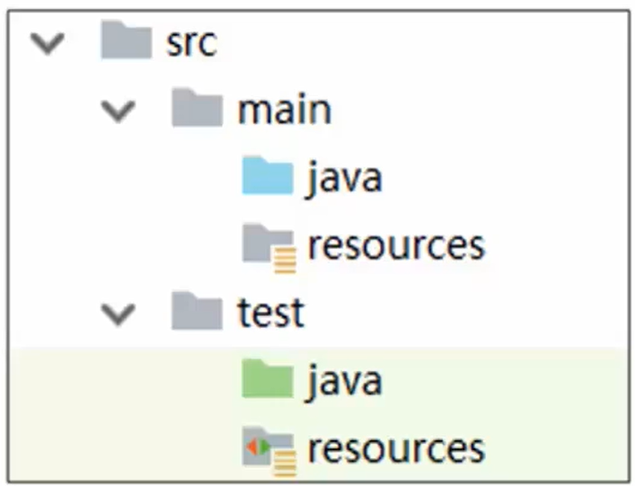
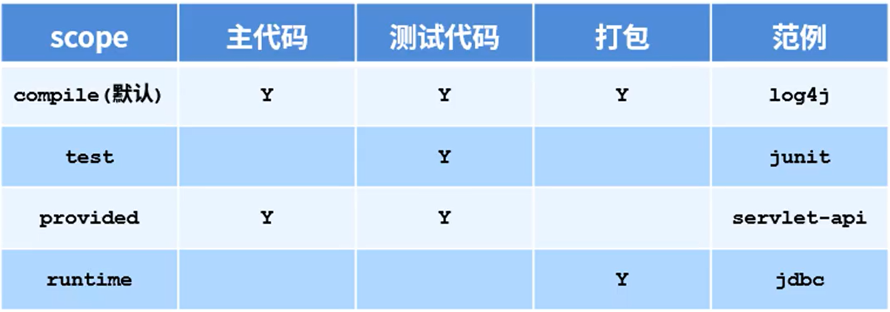
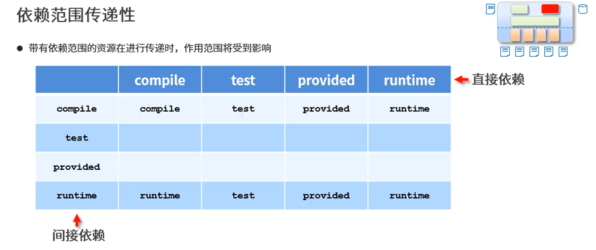
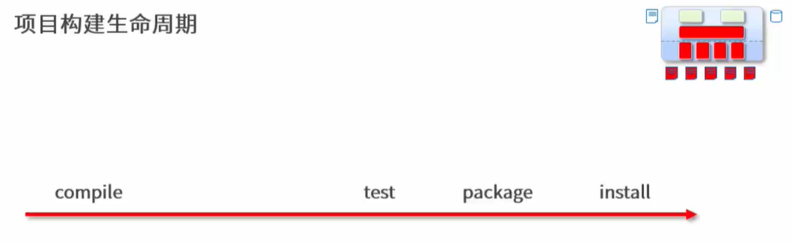

## 简介
- Maven的本质是一个项目管理工具，将项目开发和管理过程抽象成一个项目对象模型（POM）
- POM （Project Object Model）：项目对象模型

### 作用
- 项目构建、依赖管理（管jar包，避免版本冲突）
- 统一了开发结构

 蓝色文件夹为源码，绿色为test

## 依赖管理
### 依赖传递冲突问题
 - 路径优先：层次浅的优先级高
 - 声明优先：资源在同级被依赖时，配置顺序靠前的优先
 - 特殊优先：同级配置了相同资源的不同版本，后配置覆盖先配置的
 
 个人理解 最近的
 ```xml
 <!--  可选依赖 dependency中，类似于私房钱，让不让别人知道 -->
 <optional>true</optional>
 <!-- 排除依赖，主动断开与其他的联系 -->
 <exclusions>
    <exclusion>
        <groupId>org.junit.jupiter</groupId>
        <artifactId>junit-jupiter-api</artifactId>
    </exclusion>
 </exclusions>
 ```

### 依赖范围
- 依赖的jar默认情况可以 在任何地方使用，可以通过scope标签设定作用范围
>作用范围
>>主程序范围有效（main文件夹范围内）
测试程序范围有效（test文件夹范围内）
是否参与打包（package指令范围内）

这个servlet-api不参与打包因为服务器会有其api



## 项目构建生命周期
