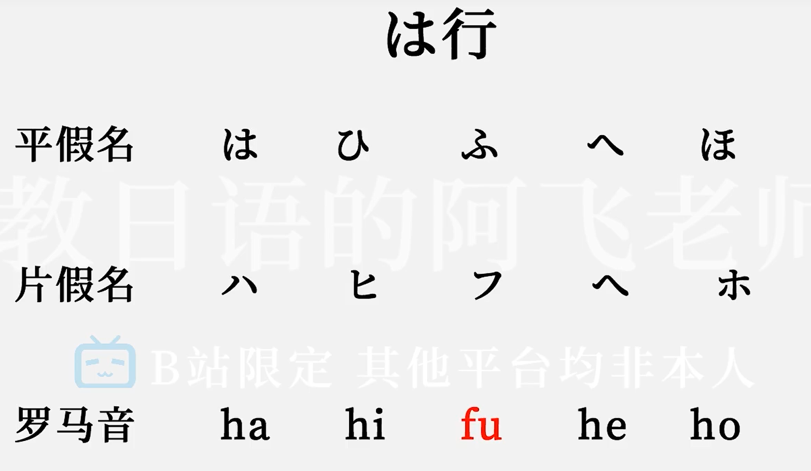
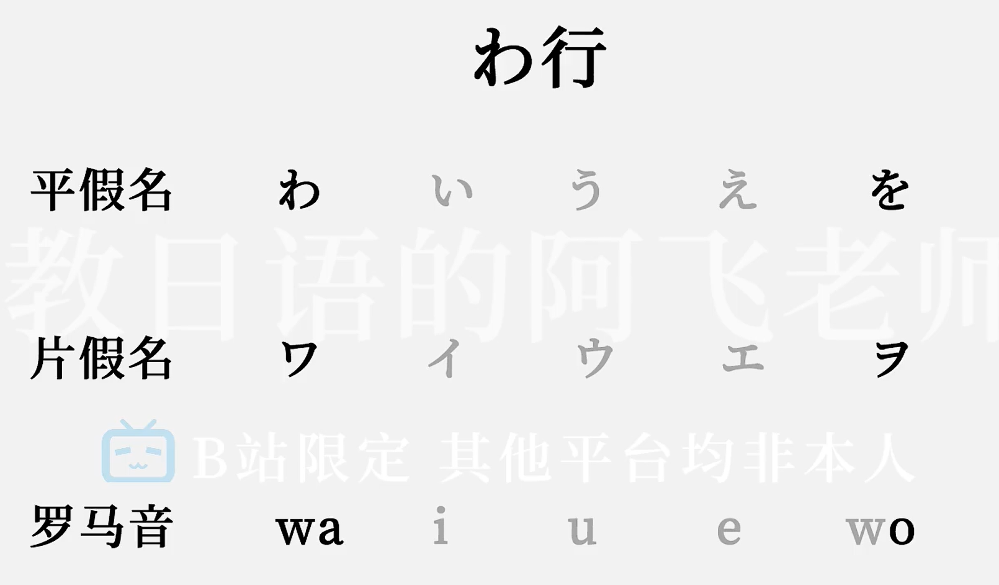

[资料来源B站](https://www.bilibili.com/video/BV1Bp4y1D747?p=2&vd_source=27965c9221f395745c5958a4e2b71636)

## 一、日语五十音
- emm,有的日语对应有汉字可以打出汉字 ，无汉字对应直接拼出来 eg：ファイオ　
- 主要あ行 列会读

### 1.Ka行

### 2.Sa行

### 3.Ta行

### 4.Na行

### 5.Ha行

### 6.Ma行

### 7.Ya行

### 8.Ra行

### 9.Wa行
这行最后一个为助词出现

### 10.n

## 二、浊音和长音

### 浊音

#### 1.が行 K-G

#### 2.ざ行 S-Z

#### 3.だ行 T-D

#### 4.ば行 H-B

### 半浊音

#### ぱ H-P

　　