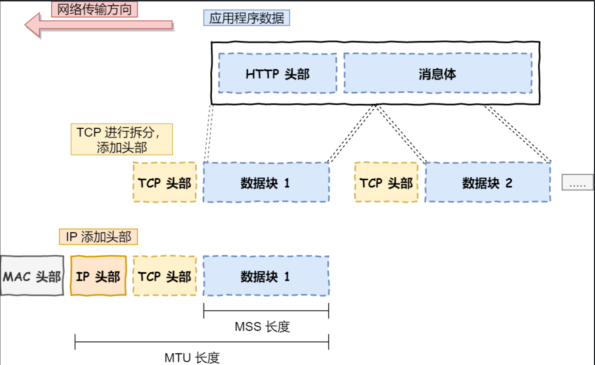

# 计算机网络篇
## 1、GET和POST的请求的区别
Post 和 Get 是 HTTP 请求的两种方法，其区别如下：

### 应用场景： 
GET 请求是一个幂等的请求，一般 Get 请求用于对服务器资源不会产生影响的场景，比如说请求一个网页的资源。而 Post 不是一个幂等的请求，一般用于对服务器资源会产生影响的情景，比如注册用户这一类的操作。
### 发送的报文格式： 
Get 请求的报文中实体部分为空，Post 请求的报文中实体部分一般为向服务器发送的数据。
### 安全性： 
Get 请求可以将请求的参数放入 url 中向服务器发送，这样的做法相对于 Post 请求来说是不太安全的，因为请求的 url 会被保留在历史记录中。
### 请求长度： 
浏览器由于对 url 长度的限制，所以会影响 get 请求发送数据时的长度。这个限制是浏览器规定的，并不是 RFC 规定的。
### 参数类型： 
post 的参数传递支持更多的数据类型。

---

## 2、POST和PUT请求的区别
  PUT请求是向服务器端发送数据，从而修改数据的内容，但是不会增加数据的种类等，也就是说无论进行多少次PUT操作，其结果并没有不同。**（可以理解为时更新数据）**
  POST请求是向服务器端发送数据，该请求会改变数据的种类等资源，它会创建新的内容。**（可以理解为是创建数据）**

---

## 3、常见的HTTP请求头和响应头
### HTTP Request Header 常见的请求头：
- Accept:浏览器能够处理的内容类型
- Accept-Charset:浏览器能够显示的字符集
- Accept-Encoding：浏览器能够处理的压缩编码
- Accept-Language：浏览器当前设置的语言
- Connection：浏览器与服务器之间连接的类型
- Cookie：当前页面设置的任何Cookie
- Host：发出请求的页面所在的域
- Referer：发出请求的页面的URL
- User-Agent：浏览器的用户代理字符串
### HTTP Responses Header 常见的响应头：
- Date：表示消息发送的时间，时间的描述格式由rfc822定义
- server:服务器名称
- Connection：浏览器与服务器之间连接的类型
- Cache-Control：控制HTTP缓存
- content-type:表示后面的文档属于什么MIME类型
#### 常见的 Content-Type 属性值有以下四种：
（1）application/x-www-form-urlencoded：浏览器的原生 form 表单，如果不设置 enctype 属性，那么最终就会以 application/x-www-form-urlencoded 方式提交数据。该种方式提交的数据放在 body 里面，数据按照 key1=val1&key2=val2 的方式进行编码，key 和 val 都进行了 URL转码。

（2）multipart/form-data：该种方式也是一个常见的 POST 提交方式，通常表单上传文件时使用该种方式。

（3）application/json：服务器消息主体是序列化后的 JSON 字符串。

（4）text/xml：该种方式主要用来提交 XML 格式的数据。

--- 

## 4、常见的HTTP请求方法

```
GET: 向服务器获取数据；
POST：将实体提交到指定的资源，通常会造成服务器资源的修改；
PUT：上传文件，更新数据；
DELETE：删除服务器上的对象；
HEAD：获取报文首部，与GET相比，不返回报文主体部分；
OPTIONS：询问支持的请求方法，用来跨域请求；
CONNECT：要求在与代理服务器通信时建立隧道，使用隧道进行TCP通信；
TRACE: 回显服务器收到的请求，主要⽤于测试或诊断。
```
--- 
## 5、HTTP 1.1 和 HTTP 2.0 的区别

- **二进制协议：** HTTP/2 是一个二进制协议。在 HTTP/1.1 版中，报文的头信息必须是文本（ASCII 编码），数据体可以是文本，也可以是二进制。HTTP/2 则是一个彻底的二进制协议，头信息和数据体都是二进制，并且统称为"帧"，可以分为头信息帧和数据帧。 帧的概念是它实现多路复用的基础。
- **多路复用：** HTTP/2 实现了多路复用，HTTP/2 仍然复用 TCP 连接，但是在一个连接里，**客户端和服务器都可以同时发送多个请求或回应**，而且不用按照顺序一一发送，这样就避免了"队头堵塞"【1】的问题。
- **数据流：** HTTP/2 使用了数据流的概念，因为 HTTP/2 的数据包是不按顺序发送的，同一个连接里面连续的数据包，可能属于不同的请求。因此，必须要对数据包做标记，指出它属于哪个请求。HTTP/2 将每个请求或回应的所有数据包，称为一个数据流。每个数据流都有一个独一无二的编号。数据包发送时，都必须标记数据流 ID ，用来区分它属于哪个数据流。
- **头信息压缩：** HTTP/2 实现了头信息压缩，由于 HTTP 1.1 协议不带状态，每次请求都必须附上所有信息。所以，请求的很多字段都是重复的，比如 Cookie 和 User Agent ，一模一样的内容，每次请求都必须附带，这会浪费很多带宽，也影响速度。HTTP/2 对这一点做了优化，引入了头信息压缩机制。一方面，头信息使用 gzip 或 compress 压缩后再发送；另一方面，客户端和服务器同时维护一张头信息表，所有字段都会存入这个表，生成一个索引号，以后就不发送同样字段了，只发送索引号，这样就能提高速度了。
- **服务器推送：** HTTP/2 允许服务器未经请求，主动向客户端发送资源，这叫做服务器推送。使用服务器推送提前给客户端推送必要的资源，这样就可以相对减少一些延迟时间。这里需要注意的是 http2 下服务器主动推送的是静态资源，和 WebSocket 以及使用 SSE 等方式向客户端发送即时数据的推送是不同的。
---
## 6、HTTP和HTTPS协议的区别
- HTTPS协议需要CA证书，费用较高；而HTTP协议不需要；
- HTTP协议是超文本传输协议，信息是明文传输的，HTTPS则是具有安全性的SSL加密传输协议；
- 使用不同的连接方式，端口也不同，HTTP协议端口是80，HTTPS协议端口是443；
- HTTP协议连接很简单，是无状态的；HTTPS协议是有SSL和HTTP协议构建的可进行加密传输、身份认证的网络协议，比HTTP更加安全。
---
## 7、浏览器输入URL后，会发生什么？
> **（1）解析URL：** 首先会对 URL 进行解析，分析所需要使用的传输协议和请求的资源的路径。如果输入的 URL 中的协议或者主机名不合法，将会把地址栏中输入的内容传递给搜索引擎。如果没有问题，浏览器会检查 URL 中是否出现了非法字符，如果存在非法字符，则对非法字符进行转义后再进行下一过程。
**（2）缓存判断：** 浏览器会判断所请求的资源是否在缓存里，如果请求的资源在缓存里并且没有失效，那么就直接使用，否则向服务器发起新的请求。
**（3）DNS解析：** 下一步首先需要获取的是输入的 URL 中的域名的 IP 地址，首先会判断本地是否有该域名的 IP 地址的缓存，如果有则使用，如果没有则向本地 DNS 服务器发起请求。本地 DNS 服务器也会先检查是否存在缓存，如果没有就会先向根域名服务器发起请求，获得负责的顶级域名服务器的地址后，再向顶级域名服务器请求，然后获得负责的权威域名服务器的地址后，再向权威域名服务器发起请求，最终获得域名的 IP 地址后，本地 DNS 服务器再将这个 IP 地址返回给请求的用户。用户向本地 DNS 服务器发起请求属于递归请求，本地 DNS 服务器向各级域名服务器发起请求属于迭代请求。
**（4）获取MAC地址：** 当浏览器得到 IP 地址后，数据传输还需要知道目的主机 MAC 地址，因为应用层下发数据给传输层，TCP 协议会指定源端口号和目的端口号，然后下发给网络层。网络层会将本机地址作为源地址，获取的 IP 地址作为目的地址。然后将下发给数据链路层，数据链路层的发送需要加入通信双方的 MAC 地址，本机的 MAC 地址作为源 MAC 地址，目的 MAC 地址需要分情况处理。通过将 IP 地址与本机的子网掩码相与，可以判断是否与请求主机在同一个子网里，如果在同一个子网里，可以使用 APR 协议获取到目的主机的 MAC 地址，如果不在一个子网里，那么请求应该转发给网关，由它代为转发，此时同样可以通过 ARP 协议来获取网关的 MAC 地址，此时目的主机的 MAC 地址应该为网关的地址。
**（5）TCP三次握手：** 下面是 TCP 建立连接的三次握手的过程，首先客户端向服务器发送一个 SYN 连接请求报文段和一个随机序号，服务端接收到请求后向服务器端发送一个 SYN ACK报文段，确认连接请求，并且也向客户端发送一个随机序号。客户端接收服务器的确认应答后，进入连接建立的状态，同时向服务器也发送一个ACK 确认报文段，服务器端接收到确认后，也进入连接建立状态，此时双方的连接就建立起来了。
**（6）HTTPS握手：** 如果使用的是 HTTPS 协议，在通信前还存在 TLS 的一个四次握手的过程。首先由客户端向服务器端发送使用的协议的版本号、一个随机数和可以使用的加密方法。服务器端收到后，确认加密的方法，也向客户端发送一个随机数和自己的数字证书。客户端收到后，首先检查数字证书是否有效，如果有效，则再生成一个随机数，并使用证书中的公钥对随机数加密，然后发送给服务器端，并且还会提供一个前面所有内容的 hash 值供服务器端检验。服务器端接收后，使用自己的私钥对数据解密，同时向客户端发送一个前面所有内容的 hash 值供客户端检验。这个时候双方都有了三个随机数，按照之前所约定的加密方法，使用这三个随机数生成一把秘钥，以后双方通信前，就使用这个秘钥对数据进行加密后再传输。
**（7）返回数据：** 当页面请求发送到服务器端后，服务器端会返回一个 html 文件作为响应，浏览器接收到响应后，开始对 html 文件进行解析，开始页面的渲染过程。
**（8）页面渲染：** 浏览器首先会根据 html 文件构建 DOM 树，根据解析到的 css 文件构建 CSSOM 树，如果遇到 script 标签，则判端是否含有 defer 或者 async 属性，要不然 script 的加载和执行会造成页面的渲染的阻塞。当 DOM 树和 CSSOM 树建立好后，根据它们来构建渲染树。渲染树构建好后，会根据渲染树来进行布局。布局完成后，最后使用浏览器的 UI 接口对页面进行绘制。这个时候整个页面就显示出来了。

---
## 8、与缓存相关的HTTP请求头有哪些
#### 强缓存：
- Expires
- Cache-Control
#### 协商缓存：
- Etag、If-None-Match
- Last-Modified、If-Modified-Since

---
## 9、什么是HTTPS协议？
**超文本传输安全协议（Hypertext Transfer Protocol Secure，简称：HTTPS）**是一种通过计算机网络进行安全通信的传输协议。HTTPS经由HTTP进行通信，利用SSL/TLS来加密数据包。HTTPS的主要目的是提供对网站服务器的身份认证，保护交换数据的隐私与完整性。

HTTP协议采用明文**传输信息**，存在信息窃听、信息篡改和信息劫持的风险，而**协议TLS/SSL具有身份验证、信息加密和完整性校验**的功能，可以避免此类问题发生。
安全层的主要职责就是对**发起的HTTP请求的数据进行加密操作** 和 **对接收到的HTTP的内容进行解密操作**。

---
## 10、TLS/SSL的工作原理
TLS/SSL全称安全传输层协议（Transport Layer Security）, 是议**介于TCP和HTTP之间的一层安全协**，不影响原有的TCP协议和HTTP协议，所以使用HTTPS基本上不需要对HTTP页面进行太多的改造。

TLS/SSL的功能实现主要依赖三类基本算法：**散列函数hash、对称加密、非对称加密**。这三类算法的作用如下：
- 基于散列函数验证信息的完整性
- 对称加密算法采用协商的秘钥对数据加密
- 非对称加密实现身份认证和秘钥协商


---
## 11、HTTP状态码
|类别 |	原因 |	描述 |
| --- | --- | ---   |
|1xx|	Informational(信息性状态码)|	接受的请求正在处理|
|2xx|	Success(成功状态码)|	请求正常处理完毕|
|3xx| Redirection(重定向状态码)|	需要进行附加操作一完成请求|
|4xx|	Client Error (客户端错误状态码)|	服务器无法处理请求|
|5xx|	Server Error(服务器错误状态码)|	服务器处理请求出错|
### 301 Moved Permanently
**永久重定向。** 该状态码表示请求的资源已经被分配了新的 URI，以后应使用资源指定的 URI。新的 URI 会在 HTTP 响应头中的 Location 首部字段指定。若用户已经把原来的URI保存为书签，此时会按照 Location 中新的URI重新保存该书签。同时，搜索引擎在抓取新内容的同时也将旧的网址替换为重定向之后的网址。
~做项目血的教训 呜呜~

---
## 12、DNS 协议是什么
**概念：** DNS 是域名系统 (Domain Name System) 的缩写，提供的是一种主机名到 IP 地址的转换服务，就是我们常说的域名系统。它是一个由分层的 DNS 服务器组成的分布式数据库，是定义了主机如何查询这个分布式数据库的方式的应用层协议。能够使人更方便的访问互联网，而不用去记住能够被机器直接读取的IP数串。

**作用：** 将域名解析为IP地址，客户端向DNS服务器（DNS服务器有自己的IP地址）发送域名查询请求，DNS服务器告知客户机Web服务器的 IP 地址。

---
## 13、DNS同时使用TCP和UDP协议？
**DNS占用53号端口，同时使用TCP和UDP协议**

#### （1）在区域传输的时候使用TCP协议
辅域名服务器会定时（一般3小时）向主域名服务器进行查询以便了解数据是否有变动。如有变动，会执行一次区域传送，进行数据同步。区域传送使用TCP而不是UDP，因为数据同步传送的数据量比一个请求应答的数据量要多得多。
TCP是一种可靠连接，保证了数据的准确性。
#### （2）在域名解析的时候使用UDP协议
客户端向DNS服务器查询域名，一般返回的内容都不超过512字节，用UDP传输即可。不用经过三次握手，这样DNS服务器负载更低，响应更快。理论上说，客户端也可以指定向DNS服务器查询时用TCP，但事实上，很多DNS服务器进行配置的时候，仅支持UDP查询包。

---
## 14、DNS完整的查询过程
- 首先会在浏览器的缓存中查找对应的IP地址，如果查找到直接返回，若找不到继续下一步
- 将请求发送给**本地DNS服务器**，在本地域名服务器缓存中查询，如果查找到，就直接将查找结果返回，若找不到继续下一步
- 本地DNS服务器向**根域名服务器**发送请求，根域名服务器会返回一个所查询域的顶级域名服务器地址
- 本地DNS服务器向**顶级域名服务器**发送请求，接受请求的服务器查询自己的缓存，如果有记录，就返回查询结果，如果没有就返回相关的下一级的权威域名服务器的地址
- 本地DNS服务器向**权威域名服务器**发送请求，域名服务器返回对应的结果
- 本地DNS服务器将返回结果保存在缓存中，便于下次使用
- 本地DNS服务器将返回结果返回给浏览器
### DNS解析是一个包含迭代查询和递归查询的过程

**递归查询**指的是查询请求发出后，域名服务器代为向下一级域名服务器发出请求，最后向用户返回查询的最终结果。使用递归 查询，用户只需要发出一次查询请求。
**迭代查询**指的是查询请求后，域名服务器返回单次查询的结果。下一级的查询由用户自己请求。使用迭代查询，用户需要发出 多次的查询请求。
<u>一般我们向本地 DNS 服务器发送请求的方式就是递归查询~</u>

#####  DNS 服务器中以资源记录的形式存储信息，每一个 DNS 响应报文一般包含多条资源记录。一条资源记录的具体的格式为：
```http
（Name，Value，Type，TTL）
```
**其中 TTL 是资源记录的生存时间，它定义了资源记录能够被其他的 DNS 服务器缓存多长时间**
常用的一共有四种 Type 的值，分别是 A、NS、CNAME 和 MX ，不同 Type 的值，对应资源记录代表的意义不同：

- 如果 Type = A，则 Name 是主机名，Value 是主机名对应的 IP 地址。因此一条记录为 A 的资源记录，提供了标 准的主机名到 IP 地址的映射。
- 如果 Type = NS，则 Name 是个域名，Value 是负责该域名的 DNS 服务器的主机名。这个记录主要用于 DNS 链式 查询时，返回下一级需要查询的 DNS 服务器的信息。
- 如果 Type = CNAME，则 Name 为别名，Value 为该主机的规范主机名。该条记录用于向查询的主机返回一个主机名 对应的规范主机名，从而告诉查询主机去查询这个主机名的 IP 地址。主机别名主要是为了通过给一些复杂的主机名提供 一个便于记忆的简单的别名。
- 如果 Type = MX，则 Name 为一个邮件服务器的别名，Value 为邮件服务器的规范主机名。它的作用和 CNAME 是一 样的，都是为了解决规范主机名不利于记忆的缺点。
--- 
## 15、网络模型
### 1）. OSI七层模型

#### （1）应用层
OSI参考模型中最靠近用户的一层，是为计算机用户提供应用接口，也为用户直接提供各种网络服务。我们常见应用层的网络服务协议有：**HTTP，HTTPS，FTP，POP3、SMTP**等。
#### （2）表示层
表示层**提供各种用于应用层数据的编码和转换功能**,确保一个系统的应用层发送的数据能被另一个系统的应用层识别。如果必要，该层可提供一种标准表示形式，用于将计算机内部的多种数据格式转换成通信中采用的标准表示形式。数据压缩和加密也是表示层可提供的转换功能之一。
#### （3）会话层
会话层就是负责建立、管理和终止表示层实体之间的通信会话。该层的通信由不同设备中的应用程序之间的服务请求和响应组成。
#### （4）传输层
传输层**建立了主机端到端的链接**，传输层的作用是为上层协议提供端到端的可靠和透明的数据传输服务，包括处理差错控制和流量控制等问题。该层向高层屏蔽了下层数据通信的细节，使高层用户看到的只是在两个传输实体间的一条主机到主机的、可由用户控制和设定的、可靠的数据通路。我们通常说的，**TCP UDP就是在这一层**。端口号既是这里的“端”。
#### （5）网络层
本层**通过IP寻址来建立两个节点之间的连接**，为源端的运输层送来的分组，选择合适的路由和交换节点，正确无误地按照地址传送给目的端的运输层。
#### （6）数据链路层
将比特组合成字节,再将字节组合成帧,使用链路层地址 (以太网使用MAC地址)来访问介质,并进行差错检测。 网络层与数据链路层的对比，通过上面的描述，我们或许可以这样理解，网络层是规划了数据包的传输路线，而数据链路层就是传输路线。不过，在数据链路层上还增加了差错控制的功能。
#### （7）物理层
实际最终信号的传输是通过物理层实现的。通过物理介质传输比特流。规定了电平、速度和电缆针脚。常用设备有（各种物理设备）集线器、中继器、调制解调器、网线、双绞线、同轴电缆。这些都是物理层的传输介质。
**OSI七层模型通信特点：对等通信** 对等通信，为了使数据分组从源传送到目的地，源端OSI模型的每一层都必须与目的端的对等层进行通信，这种通信方式称为对等层通信。在每一层通信过程中，使用本层自己协议进行通信。

### 2）.TCP/IP五层协议

- 应用层 (application layer)：直接为应用进程提供服务。应用层协议定义的是应用进程间通讯和交互的规则，不同的应用有着不同的应用层协议，如 HTTP协议（万维网服务）、FTP协议（文件传输）、SMTP协议（电子邮件）、DNS（域名查询）等。
- 传输层 (transport layer)：有时也译为运输层，它负责为两台主机中的进程提供通信服务。该层主要有以下两种协议：
- 传输控制协议 (Transmission Control Protocol，TCP)：提供面向连接的、可靠的数据传输服务，数据传输的基本单位是报文段（segment）；
- 用户数据报协议 (User Datagram Protocol，UDP)：提供无连接的、尽最大努力的数据传输服务，但不保证数据传输的可靠性，数据传输的基本单位是用户数据报。
- 网络层 (internet layer)：有时也译为网际层，它负责为两台主机提供通信服务，并通过选择合适的路由将数据传递到目标主机。
- 数据链路层 (data link layer)：负责将网络层交下来的 IP 数据报封装成帧，并在链路的两个相邻节点间传送帧，每一帧都包含数据和必要的控制信息（如同步信息、地址信息、差错控制等）。
- 物理层 (physical Layer)：确保数据可以在各种物理媒介上进行传输，为数据的传输提供可靠的环境。


---
## 16、TCP与UDP
TCP 和 UDP都是传输层协议，他们都属于TCP/IP协议族：
### （1）UDP
UDP的全称是用户数据报协议，在网络中它与TCP协议一样用于处理数据包，是一种无连接的协议。在OSI模型中，在传输层，处于IP协议的上一层。UDP有不提供数据包分组、组装和不能对数据包进行排序的缺点，也就是说，当报文发送之后，是无法得知其是否安全完整到达的。

**它的特点如下：**

>1）面向无连接
首先 UDP 是不需要和 TCP一样在发送数据前进行三次握手建立连接的，想发数据就可以开始发送了。并且也只是数据报文的搬运工，不会对数据报文进行任何拆分和拼接操作。
具体来说就是：
在发送端，应用层将数据传递给传输层的 UDP 协议，UDP 只会给数据增加一个 UDP 头标识下是 UDP 协议，然后就传递给网络层了
在接收端，网络层将数据传递给传输层，UDP 只去除 IP 报文头就传递给应用层，不会任何拼接操作
2）有单播，多播，广播的功能
UDP 不止支持一对一的传输方式，同样支持一对多，多对多，多对一的方式，也就是说 UDP 提供了单播，多播，广播的功能。
3）面向报文
发送方的UDP对应用程序交下来的报文，在添加首部后就向下交付IP层。UDP对应用层交下来的报文，既不合并，也不拆分，而是保留这些报文的边界。因此，应用程序必须选择合适大小的报文
4）不可靠性
首先不可靠性体现在无连接上，通信都不需要建立连接，想发就发，这样的情况肯定不可靠。
并且收到什么数据就传递什么数据，并且也不会备份数据，发送数据也不会关心对方是否已经正确接收到数据了。
再者网络环境时好时坏，但是 UDP 因为没有拥塞控制，一直会以恒定的速度发送数据。即使网络条件不好，也不会对发送速率进行调整。这样实现的弊端就是在网络条件不好的情况下可能会导致丢包，但是优点也很明显，在某些实时性要求高的场景（比如电话会议）就需要使用 UDP 而不是 TCP。
5）头部开销小，传输数据报文时是很高效的。

### （2）TCP 
TCP的全称是传输控制协议是一种面向连接的、可靠的、基于字节流的传输层通信协议。TCP 是面向连接的、可靠的流协议（流就是指不间断的数据结构）。

**它有以下几个特点：**

>1）面向连接
面向连接，是指发送数据之前必须在两端建立连接。建立连接的方法是“三次握手”，这样能建立可靠的连接。建立连接，是为数据的可靠传输打下了基础。
2）仅支持单播传输
每条TCP传输连接只能有两个端点，只能进行点对点的数据传输，不支持多播和广播传输方式。
3）面向字节流
TCP不像UDP一样那样一个个报文独立地传输，而是在不保留报文边界的情况下以字节流方式进行传输。
4）可靠传输
对于可靠传输，判断丢包、误码靠的是TCP的段编号以及确认号。TCP为了保证报文传输的可靠，就给每个包一个序号，同时序号也保证了传送到接收端实体的包的按序接收。然后接收端实体对已成功收到的字节发回一个相应的确认(ACK)；如果发送端实体在合理的往返时延(RTT)内未收到确认，那么对应的数据（假设丢失了）将会被重传。
5）提供拥塞控制
当网络出现拥塞的时候，TCP能够减小向网络注入数据的速率和数量，缓解拥塞。
6）提供全双工通信
TCP允许通信双方的应用程序在任何时候都能发送数据，因为TCP连接的两端都设有缓存，用来临时存放双向通信的数据。当然，TCP可以立即发送一个数据段，也可以缓存一段时间以便一次发送更多的数据段（最大的数据段大小取决于MSS）

---
## 17、WebSocket
WebSocket是HTML5提供的一种浏览器与服务器进行**全双工通讯**的网络技术，属于应用层协议。它基于TCP传输协议，并复用HTTP的握手通道。浏览器和服务器只需要完成一次握手，两者之间就直接可以创建持久性的连接， 并进行双向数据传输。
WebSocket 的出现就解决了半双工通信的弊端。它最大的特点是：**服务器可以向客户端主动推动消息，客户端也可以主动向服务器推送消息。**
### WebSocket原理：
客户端向 WebSocket 服务器通知（notify）一个带有所有接收者ID（recipients IDs）的事件（event），服务器接收后立即通知所有活跃的（active）客户端，只有ID在接收者ID序列中的客户端才会处理这个事件。​
### WebSocket 特点的如下：
- 支持双向通信，实时性更强
- 可以发送文本，也可以发送二进制数据‘’
- 建立在TCP协议之上，服务端的实现比较容易
- 数据格式比较轻量，性能开销小，通信高效
- 没有同源限制，客户端可以与任意服务器通信
- 协议标识符是ws（如果加密，则为wss），服务器网址就是 URL
- 与 HTTP 协议有着良好的兼容性。默认端口也是80和443，并且握手阶段采用 HTTP 协议，因此握手时不容易屏蔽，- 能通过各种 HTTP 代理服务器。
### Websocket的使用方法如下：
```javascript
// 在index.html中直接写WebSocket，设置服务端的端口号为 9999
let ws = new WebSocket('ws://localhost:9999');
// 在客户端与服务端建立连接后触发
ws.onopen = function() {
    console.log("Connection open."); 
    ws.send('hello');
};
// 在服务端给客户端发来消息的时候触发
ws.onmessage = function(res) {
    console.log(res);       // 打印的是MessageEvent对象
    console.log(res.data);  // 打印的是收到的消息
};
// 在客户端与服务端建立关闭后触发
ws.onclose = function(evt) {
  console.log("Connection closed.");
}; 
```
### 即时通讯的实现：短轮询、长轮询、SSE 和 WebSocket 间的区别？
短轮询和长轮询的目的都是用于实现客户端和服务器端的一个即时通讯。

>**短轮询的基本思路：** 浏览器每隔一段时间向浏览器发送 http 请求，服务器端在收到请求后，不论是否有数据更新，都直接进行响应。这种方式实现的即时通信，本质上还是浏览器发送请求，服务器接受请求的一个过程，通过让客户端不断的进行请求，使得客户端能够模拟实时地收到服务器端的数据的变化。这种方式的优点是比较简单，易于理解。缺点是这种方式由于需要不断的建立 http 连接，严重浪费了服务器端和客户端的资源。当用户增加时，服务器端的压力就会变大，这是很不合理的。
**长轮询的基本思路：** 首先由客户端向服务器发起请求，当服务器收到客户端发来的请求后，服务器端不会直接进行响应，而是先将这个请求挂起，然后判断服务器端数据是否有更新。如果有更新，则进行响应，如果一直没有数据，则到达一定的时间限制才返回。客户端 JavaScript 响应处理函数会在处理完服务器返回的信息后，再次发出请求，重新建立连接。长轮询和短轮询比起来，它的优点是明显减少了很多不必要的 http 请求次数，相比之下节约了资源。长轮询的缺点在于，连接挂起也会导致资源的浪费。
**SSE 的基本思想：** 服务器使用流信息向服务器推送信息。严格地说，http 协议无法做到服务器主动推送信息。但是，有一种变通方法，就是服务器向客户端声明，接下来要发送的是流信息。也就是说，发送的不是一次性的数据包，而是一个数据流，会连续不断地发送过来。这时，客户端不会关闭连接，会一直等着服务器发过来的新的数据流，视频播放就是这样的例子。SSE 就是利用这种机制，使用流信息向浏览器推送信息。它基于 http 协议，目前除了 IE/Edge，其他浏览器都支持。它相对于前面两种方式来说，不需要建立过多的 http 请求，相比之下节约了资源。
**WebSocket**是 HTML5 定义的一个新协议议，与传统的 http 协议不同，该协议允许由服务器主动的向客户端推送信息。使用 WebSocket 协议的缺点是在服务器端的配置比较复杂。WebSocket 是一个全双工的协议，也就是通信双方是平等的，可以相互发送消息，而 SSE 的方式是单向通信的，只能由服务器端向客户端推送信息，如果客户端需要发送信息就是属于下一个 http 请求了。

上面的四个通信协议，前三个都是基于HTTP协议的。

对于这四种即使通信协议，从性能的角度来看： **WebSocket > 长连接（SEE） > 长轮询 > 短轮询** 但是，我们如果考虑浏览器的兼容性问题，顺序就恰恰相反了： 短轮询 > 长轮询 > 长连接（SEE） > WebSocket 所以，还是要根据具体的使用场景来判断使用哪种方式。

---
## 18、图解网络——TCP IP 运输、网络层增加头部
